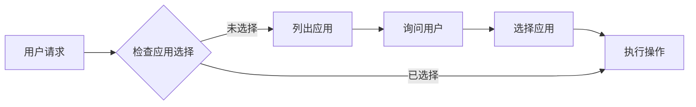

# TapTap Open API MCP 服务器

> 基于 Model Context Protocol (MCP) 的 **TapTap 小游戏和 H5 游戏**服务器，提供排行榜、分享、多人联机、云存档，以及当前游戏 DC 数据查询、统计概览与评价操作能力，并支持 **OAuth 2.0 零配置认证**。

🔐 **零配置 OAuth** | 📚 **完整文档** | 🎯 **丰富 Tools & Resources** | 🌍 **小游戏 & H5** | 📦 **单文件 Bundle**

## ✨ 核心特性

- **🔐 零配置认证** - OAuth 2.0 Device Code Flow，扫码即用
- **📖 完整 API 文档** - 6 个排行榜 API + 详细代码示例
- **⚙️ 服务端管理** - 创建/管理排行榜，自动处理 ID
- **🎮 H5 游戏支持** - 上传、发布、状态查询
- **🧭 当前游戏 DC 能力** - 商店/评价/社区统计概览、商店快照、论坛内容、评价列表、评价点赞、官方回复
- **🦞 OpenClaw Plugin** - 提供一个原生 OpenClaw plugin 子包，内部复用 TapTap MCP 运行时并暴露 raw JSON 工具 + bundled skill
- **🚀 三种传输模式** - stdio（本地）、SSE（远程/实时）、HTTP（兼容）
- **🔌 多客户端并发** - 独立会话管理，无限并发
- **📦 单文件 Bundle** - 零依赖，包体积减少 96%（567 KB）
- **🤖 智能引导** - AI Agent 自动验证前置条件，主动询问用户选择

**NPM**: [@taptap/instant-games-open-mcp](https://www.npmjs.com/package/@taptap/instant-games-open-mcp)

## 🦞 OpenClaw Plugin（实验中）

仓库内提供了一个可独立发布的 OpenClaw plugin 子包：

- [`packages/openclaw-dc-plugin`](packages/openclaw-dc-plugin)

这个子包的设计目标是：

- 让 OpenClaw 用户只安装一个 plugin
- plugin 内部复用 `@taptap/instant-games-open-mcp` 运行时
- 对 OpenClaw 暴露 raw JSON 工具
- 同时内置 `taptap-dc-ops-brief` skill，让模型自己做简报解读

说明：

- 主包里的 `*_raw` tools 默认不会暴露给普通 MCP 客户端
- 只有设置 `TAPTAP_MCP_ENABLE_RAW_TOOLS=true` 时才会注册
- OpenClaw plugin 会自动打开这个开关，因此插件用户不需要额外配置

详见：

- [OpenClaw Plugin 说明](docs/OPENCLAW_PLUGIN.md)
- 维护者发布方式：`npm run openclaw:pack` / `npm run openclaw:publish`

## 🧩 Codex Skills（运营简报）

本仓库内置一个面向运营/工作室的 Codex Skill：`taptap-dc-ops-brief`，用于把“当前游戏 DC 数据”整理成 30 秒可读的结论简报，并在你确认后执行评价点赞/官方回复等动作。

### 安装到 Codex

在已安装 Codex 的机器上运行：

```bash
python3 ~/.codex/skills/.system/skill-installer/scripts/install-skill-from-github.py \
  --repo taptap/instant-games-open-mcp \
  --path skills/taptap-dc-ops-brief
```

安装完成后重启 Codex，即可在对话中使用：

> 使用 `$taptap-dc-ops-brief` 生成当前游戏的 7 日运营简报，并给出是否建议点赞/回复评价（先出草稿，等我确认再发）。

## 🚀 快速开始

> 🐣 **完全不懂技术？** [快速开始（零基础版）](docs/QUICK_START.md) - 3 分钟搞定 Cursor 配置，复制粘贴就能用。
>
> 📖 **想了解更多配置？** [详细配置指南](docs/USER_GUIDE.md) - Cursor、Claude Code、VS Code、Claude Desktop 等多种工具的配置方法。

### 安装

```bash
# 全局安装
npm install -g @taptap/instant-games-open-mcp

# 或使用 npx 直接运行（无需安装）
npx @taptap/instant-games-open-mcp
```

### 配置（MCP 客户端）

#### Claude Code / VSCode / Cursor

在项目中创建 `.mcp.json`:

```json
{
  "mcpServers": {
    "taptap-minigame": {
      "command": "npx",
      "args": ["-y", "@taptap/instant-games-open-mcp"],
      "env": {
        "TAPTAP_MCP_WORKSPACE_ROOT": "${workspaceFolder}"
      }
    }
  }
}
```

**重要说明**：

- **零配置 OAuth**：首次使用会提示扫码授权，token 自动保存！
- **路径处理**：设置 `TAPTAP_MCP_WORKSPACE_ROOT` 环境变量可以正确解析相对路径（推荐）
  - 如果不设置，相对路径会基于用户 HOME 目录（可能不符合预期）
  - 建议使用绝对路径，或配置 `TAPTAP_MCP_WORKSPACE_ROOT`

#### OpenHands（推荐 SSE 模式）

**远程部署**:

```bash
# 启动 SSE 服务器
TAPTAP_MCP_TRANSPORT=sse TAPTAP_MCP_PORT=3000 \
npx @taptap/instant-games-open-mcp
```

**OpenHands 配置**:

```json
{
  "mcpServers": {
    "taptap-minigame": {
      "url": "http://your-server:3000",
      "transport": "sse"
    }
  }
}
```

✅ SSE 模式支持实时进度推送！

### Docker 部署

```bash
# 快速启动（同时运行 Production 和 RND 环境）
cd docker/npm
docker-compose up -d

# 健康检查
curl http://localhost:5003/health  # Production
curl http://localhost:5002/health  # RND
```

详见: [Docker 部署文档](docker/README.md)

## 📖 功能列表

### 核心 Tools（含当前游戏 DC 能力）

#### 流程指引 (1)

- `get_leaderboard_integration_guide` - 排行榜完整接入工作流指引

#### 信息查询 (2)

- `get_current_app_info` - 获取当前应用信息
- `check_environment` - 检查环境配置

#### 认证 (3)

- `start_oauth_authorization` - 开始 OAuth 授权（获取二维码）
- `complete_oauth_authorization` - 完成 OAuth 授权
- `clear_auth_data` - 清除认证数据和缓存

#### 应用管理 (3)

- `list_developers_and_apps` - 列出所有开发者和应用（含关卡与非关卡）
- `select_app` - 选择当前应用（支持关卡与非关卡）
- `create_developer` - 创建新开发者

#### 当前游戏 DC 能力 (8)

- `get_current_app_store_overview` - 获取当前游戏商店统计概览（曝光、下载、预约、下载请求趋势）
- `get_current_app_review_overview` - 获取当前游戏评价统计概览（评分、好中差评、评分趋势）
- `get_current_app_community_overview` - 获取当前游戏社区统计概览（帖子、关注、浏览、趋势）
- `get_current_app_store_snapshot` - 获取当前游戏商店结果型快照
- `get_current_app_forum_contents` - 获取当前游戏论坛内容
- `get_current_app_reviews` - 获取当前游戏评价列表
- `like_current_app_review` - 给当前游戏指定评价点赞
- `reply_current_app_review` - 以官方身份回复当前游戏评价

#### 排行榜管理 (5)

- `create_leaderboard` - 创建排行榜
- `list_leaderboards` - 列出排行榜
- `publish_leaderboard` - 发布排行榜
- `get_user_leaderboard_scores` - 获取用户分数
- `get_app_status` - 获取应用审核状态

#### H5 游戏管理 (3)

- `prepare_h5_upload` - 收集 H5 游戏信息（上传前）
- `upload_h5_game` - 上传 H5 游戏包
- `get_debug_feedbacks` - 拉取用户调试反馈并下载日志/截图

#### 振动 API 文档 (1)

- `get_vibrate_integration_guide` - 振动 API 完整文档和接入指引

### 11 个 Resources

完整的排行榜 API 文档：

- `docs://leaderboard/overview` - 完整概览
- `docs://leaderboard/api/get-manager` - 初始化
- `docs://leaderboard/api/submit-scores` - 提交分数
- `docs://leaderboard/api/open` - 显示 UI
- `docs://leaderboard/api/load-scores` - 加载数据
- `docs://leaderboard/api/load-player-score` - 玩家排名
- `docs://leaderboard/api/load-centered-scores` - 周围玩家

完整的振动 API 文档：

- `docs://vibrate/overview` - 完整概览
- `docs://vibrate/api/vibrate-short` - 短振动 API
- `docs://vibrate/api/vibrate-long` - 长振动 API
- `docs://vibrate/patterns` - 使用模式和最佳实践

## 🎯 使用示例

### 接入排行榜

```
用户: "我想在游戏中接入排行榜"

AI 调用: get_integration_guide
→ 返回完整工作流（创建排行榜 → 客户端代码 → 测试）

AI 调用: create_leaderboard
→ 创建服务端排行榜

AI 读取: docs://leaderboard/api/submit-scores
→ 获取客户端代码示例
```

### OAuth 授权（首次）

```
AI 调用: create_leaderboard
→ 🔐 需要授权，显示二维码链接

用户: 扫码后告知 "已授权"

AI 调用: complete_oauth_authorization
→ ✅ 授权完成，token 已保存

AI 调用: create_leaderboard
→ ✅ 排行榜创建成功
```

## 🛠️ 开发

### 环境要求

- Node.js 18.14.1+
- npm 或 pnpm

### 本地开发

```bash
# 安装依赖
npm install

# 启动开发服务器
npm run dev

# 构建
npm run build

# 运行测试
npm test
```

### 环境变量

**OAuth 认证（推荐）**:

- 无需配置！自动保存 token 到 `~/.config/taptap-minigame/`

**手动配置（可选）**:

- `TAPTAP_MCP_MAC_TOKEN` - MAC Token（JSON 格式）
- `TAPTAP_MCP_CLIENT_ID` - 客户端 ID（非必需，不配置会导致部分工具无法使用）
- `TAPTAP_MCP_CLIENT_SECRET` - 签名密钥（非必需，不配置会导致部分工具无法使用）

**其他**:

- `TAPTAP_MCP_ENV` - 环境：`production`（默认）或 `rnd`
- `TAPTAP_MCP_DC_CURRENT_APP_BASE_URL` - 当前游戏 DC 接口 host 覆盖（可选，路径仍为 `/mcp/v1/current-app/...`）
- `TAPTAP_MCP_TRANSPORT` - 传输模式：`stdio`（默认）、`sse`、`http`
- `TAPTAP_MCP_PORT` - 端口（默认 3000）
- `TAPTAP_MCP_VERBOSE` - 详细日志：`true` 或 `false`
- `TAPTAP_MCP_CACHE_DIR` - 缓存目录（默认 `/tmp/taptap-mcp/cache`）
- `TAPTAP_MCP_TEMP_DIR` - 临时文件目录（默认 `/tmp/taptap-mcp/temp`）

**日志配置**:

- `TAPTAP_MCP_LOG_ROOT` - 日志根目录（默认 `/tmp/taptap-mcp/logs`）
- `TAPTAP_MCP_LOG_FILE` - 启用文件日志：`true` 或 `false`（默认 `false`）
- `TAPTAP_MCP_LOG_LEVEL` - 日志级别（RFC 5424）：`debug`、`info`、`notice`、`warning`、`error`、`critical`、`alert`、`emergency`（默认 `info`）
- `TAPTAP_MCP_LOG_MAX_DAYS` - 日志保留天数（默认 7）

详细说明请参考 [docs/LOG_SYSTEM.md](docs/LOG_SYSTEM.md)

### 添加新功能

```bash
# 使用脚手架
./scripts/create-feature.sh

# 按提示输入功能信息
# 自动生成模块结构到 src/features/yourFeature/
```

## 🤖 AI Agent 智能引导

本服务器经过精心设计，通过工具描述引导 AI Agent 提供更智能的用户体验：

### 自动前置条件检查

AI Agent 会在执行排行榜操作前，自动检查是否已选择应用：

```
用户: "创建一个排行榜"

AI: 让我先检查当前是否已选择应用...
    [调用 get_current_app_info]

    发现尚未选择应用，我来帮您列出可用的应用：
    [调用 list_developers_and_apps]

    请问您想为哪个应用创建排行榜？
    1. 游戏 A (Developer: 开发者A, App ID: 12345)
    2. 游戏 B (Developer: 开发者B, App ID: 67890)
```

### 主动询问用户选择

当有多个选项时，AI Agent 会主动展示列表并询问用户：

```
用户: "查看排行榜"

AI: 您有以下几个排行榜：
    1. 每日高分榜 (ID: lb_001)
    2. 周排行榜 (ID: lb_002)
    3. 全服总榜 (ID: lb_003)

    请问您想查看哪一个？
```

### 工作流程自动优化

AI Agent 会自动引导用户完成必要的步骤，避免操作失败：



**受益场景：**

- 创建/查询排行榜
- 发布排行榜
- 上传 H5 游戏
- 所有需要应用上下文的操作

**技术实现：**
通过在工具描述中使用 `**PREREQUISITE:**`、`**CRITICAL:**`、`**IMPORTANT:**` 等关键词，以及明确的步骤指导，让 AI Agent 理解何时需要检查前置条件、何时应该询问用户。

详见：[CLAUDE.md - AI Agent 工具使用指导](CLAUDE.md#ai-agent-工具使用指导)

## 📚 文档

### 用户文档

- **[docs/USER_GUIDE.md](docs/USER_GUIDE.md)** - 🐣 新手配置指南（Cursor/VS Code/Claude Code）
- **[CONTRIBUTING.md](CONTRIBUTING.md)** - 贡献指南
- **[CHANGELOG.md](CHANGELOG.md)** - 版本变更历史

### 技术文档

- **[docs/ARCHITECTURE.md](docs/ARCHITECTURE.md)** - 架构文档
- **[docs/DEPLOYMENT.md](docs/DEPLOYMENT.md)** - 部署指南（本地、Docker、开发者测试）
- **[docs/PROXY.md](docs/PROXY.md)** - MCP Proxy 开发指南（面向 TapCode 等平台）
- **[docs/CI_CD.md](docs/CI_CD.md)** - CI/CD 和自动化发布流程
- **[docs/PATH_RESOLUTION.md](docs/PATH_RESOLUTION.md)** - 路径解析系统

## 🔄 CI/CD

基于 Conventional Commits 的完全自动化发布：

```bash
# 创建功能分支
git checkout -b feat/awesome-feature

# 提交代码
git commit -m "feat: add awesome feature"

# 创建 PR 并合并
gh pr create && gh pr merge

# 自动发布到 npm（版本：1.4.13 → 1.5.0）
```

**发布流程**：

1. PR 合并 → 触发 Actions
2. 分析 commits 确定版本号
3. 发布到 npm
4. 自动创建版本 PR 并合并
5. 创建 GitHub Release

详见: [docs/CI_CD.md](docs/CI_CD.md)

## 🤝 贡献

欢迎贡献！请遵循：

1. Fork 仓库并创建 feature 分支
2. 使用 Conventional Commits 规范
3. 创建 PR，等待 CI 检查
4. Review 通过后合并

## 📄 许可证

MIT

## 🔗 相关链接

- [TapTap 开发者中心](https://developer.taptap.cn/)
- [官方 API 文档](https://developer.taptap.cn/minigameapidoc/dev/api/open-api/leaderboard/)
- [MCP 协议规范](https://modelcontextprotocol.io/)
- [Issues](https://github.com/taptap/instant-games-open-mcp/issues)
