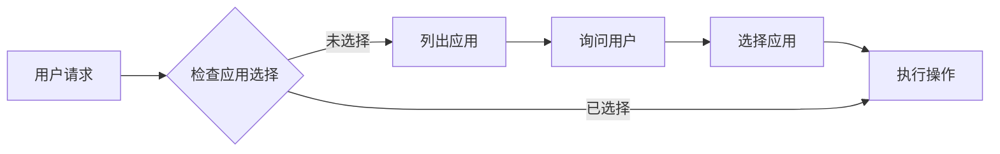

# TapTap Open API MCP 服务器

> 基于 Model Context Protocol (MCP) 的 **TapTap 小游戏和 H5 游戏**服务器，提供排行榜、分享、多人联机、云存档，以及当前游戏 DC 数据查询、统计概览与评价操作能力，并支持 **OAuth 2.0 零配置认证**。

🔐 **零配置 OAuth** | 📚 **完整文档** | 🎯 **丰富 Tools & Resources** | 🌍 **小游戏 & H5** | 📦 **单文件 Bundle**

## ✨ 核心特性

- **🔐 零配置认证** - OAuth 2.0 Device Code Flow，扫码即用
- **📖 完整 API 文档** - 6 个排行榜 API + 详细代码示例
- **⚙️ 服务端管理** - 创建/管理排行榜，自动处理 ID
- **🎮 H5 游戏支持** - 上传、发布、状态查询
- **🧭 当前游戏 DC 能力** - 商店/评价/社区统计概览、商店快照、论坛内容、评价列表、评价点赞、官方回复
- **🦞 OpenClaw Plugin** - 提供一个原生 OpenClaw plugin 子包，内部复用 TapTap MCP 运行时并暴露 raw JSON 工具 + bundled skill
- **🚀 三种传输模式** - stdio（本地）、SSE（远程/实时）、HTTP（兼容）
- **🔌 多客户端并发** - 独立会话管理，无限并发
- **📦 单文件 Bundle** - 零依赖，包体积减少 96%（567 KB）
- **🤖 智能引导** - AI Agent 自动验证前置条件，主动询问用户选择

**NPM**: [@taptap/instant-games-open-mcp](https://www.npmjs.com/package/@taptap/instant-games-open-mcp)

## 🦞 OpenClaw Plugin（实验中）

仓库内提供了一个可独立发布的 OpenClaw plugin 子包：

- [`packages/openclaw-dc-plugin`](packages/openclaw-dc-plugin)

这个子包的设计目标是：

- 让 OpenClaw 用户只安装一个 plugin
- plugin 内部复用 `@taptap/instant-games-open-mcp` 运行时
- 对 OpenClaw 暴露 raw JSON 工具
- 同时内置 `taptap-dc-ops-brief` skill，让模型自己做简报解读

说明：

- 主包里的 `*_raw` tools 默认不会暴露给普通 MCP 客户端
- 只有设置 `TAPTAP_MCP_ENABLE_RAW_TOOLS=true` 时才会注册
- OpenClaw plugin 会自动打开这个开关，因此插件用户不需要额外配置

详见：

- [OpenClaw Plugin 说明](docs/OPENCLAW_PLUGIN.md)
- 维护者发布方式：`npm run openclaw:pack` / `npm run openclaw:publish`

## 🛠️ TapTap Maker 本地 MCP（开发中）

仓库内新增 Maker 专用入口 `taptap-maker`，用于在 Codex 当前目录完成 Maker 项目的登录、选择、拉取和推送。

当前 MCP 工具流程：

```text
maker_status
maker_exchange_pat(manual_pat)
自动获取 TapTap token
自动列出 app
maker_list_apps
用户选择 app
maker_clone_to_current_directory
maker_build_current_directory
maker_submit_current_directory
```

说明：

- Maker MCP 依赖用户本机已有 Git。工具只检测并给出安装引导，不会代替用户安装 Git。
- 用户说“我要开发maker游戏 / 本地maker开发 / 拉取maker游戏到本地 / 把maker游戏代码拉到本地 / clone maker项目 / 下载maker游戏代码 / 初始化maker开发目录 / 配置maker本地开发 / 继续开发maker项目”时，应触发 Maker 本地开发初始化流程。
- 如果 `maker_status` 显示 Git 缺失，必须持续提示用户自行安装 Git；在 `git --version` 可用前，不执行 clone、fetch、commit 或 push。
- Maker API、git 和 TapTap token 默认走 PAT-first：如果用户还没有 PAT，引导用户打开当前环境的 PAT 页面新建 PAT（production：`https://maker.taptap.cn/pat-tokens`，RND：`https://fuping.agnt.xd.com/pat-tokens`）；用户提供 PAT 后调用 `maker_exchange_pat(manual_pat)` 保存。
- 保存 PAT 后会自动列出 app；`maker_status` 如果发现本地已有 PAT 且当前目录未绑定，也会自动列出 app，无需用户额外要求。
- 保存 PAT 后会自动调用 `GET /api/v1/user/taptap-token` 获取并保存 TapTap MAC token。
- `maker_list_apps` 和 `maker_clone_to_current_directory` 不再要求先完成 Tap 登录。
- `maker_clone_to_current_directory` 不要求当前目录为空；clone 前会检查本地目录，忽略 `.claude`、`.mcp`、`.skill`、`.config`、`.ini` 等点开头配置项，只对普通本地文件输出提醒。clone 最终结果固定包含 `Pre-clone local directory check` 区块；已有本地文件会保留，若与 Maker 项目文件同路径冲突则失败并列出冲突文件。
- `maker_list_apps` 会解析 Maker `/apps` 返回的创建时间、最近会话时间、游戏类型、阶段、图标、置顶/归档/删除时间等字段，并保留原始 `raw` 数据。
- PAT 会保存到 `~/.taptap-maker/pat.json`，并兼容旧的 `~/.maker-pat`、`PAT` / `MAKER_PAT` 环境变量。
- 只有当前目录未绑定且用户要初始化或 clone 时，才通过 app 列表让用户选择并调用 clone；已绑定目录里的 app 列表只作账号项目参考，应继续当前项目，除非用户明确要求切换或重新 clone。
- Maker 后端地址按 `TAPTAP_MCP_ENV` 从 `src/maker/config.ts` 的环境配置表读取，本地 MCP 配置只需要切 `rnd` / `production`。
- 如果用户直接说“构建 / build / 重新构建游戏”，本地 Maker MCP 应调用 `maker_build_current_directory`。该工具会强制检查本地 Maker 项目是否有未提交改动。
- 如果构建前发现本地有改动且尚未保存自动提交偏好，工具会停止并提示用户选择：`提交本地改动并触发构建（以后都是如此）`，或明确不提交、只构建云端已有版本。
- 用户选择 `提交本地改动并触发构建（以后都是如此）` 后，应再次调用 `maker_build_current_directory` 并传入 `submit_local_changes_before_build=true` 和 `remember_build_submit_preference=true`；工具会完整执行 commit + push + build，并在当前项目 `.maker-mcp/config.json` 记住偏好。
- 保存偏好后，后续用户说“构建”且本地有改动时，`maker_build_current_directory` 会默认自动提交并继续执行远端 build，不再重复询问。
- 只有当用户明确说“不提交 / 直接构建云端版本”时，才可再次调用 `maker_build_current_directory` 并传入 `confirm_remote_build_without_submit=true`。
- 用户说“查看结果 / 预览 / 跑一下 / 验证一下 / 看看效果”时，也按构建流程处理；如果本地有改动，先提醒用户选择是否提交，确认提交后执行 commit + push + build。
- 构建转发会从 MCP 包自身定位 `dist/proxy.js`；`cwd` / `target_dir` 只用于识别 Maker 游戏项目，不要求游戏目录存在 MCP 的 `dist/proxy.js`。
- 用户未指定构建入口且本地存在 `scripts/main.lua` 时，Maker MCP 默认向远端 build 传 `scriptsPath="scripts"` 和 `entry="main.lua"`，避免第一次构建多一轮“入口配置缺失”的提示；用户显式传入口或多人入口时优先生效。
- 远端 proxy 配置是内部能力，不单独暴露给 Agent；构建工具会在需要时直接使用远端 Maker MCP。
- 用户说“帮我提交/提交代码”时使用 `maker_submit_current_directory`，会对当前 Maker 项目执行 commit + push + build；只有实际 push 成功后才继续远端 build。
- “帮我提交代码到maker / taptap制造 / tap制造 / tap / push / 提交并推送”也应触发 `maker_submit_current_directory`，并在 push 成功后继续远端 build。
- Maker 项目提交不走通用 Git skill 的任务号、新分支规则；冲突时先和用户确认 pull/rebase 流程。
- 如果 commit 已完成但 push 失败，Maker MCP 会返回 commit hash、ahead 状态、exit code、stderr/stdout 和下一步建议，便于开发期排查。
- clone/fetch、push 和远端 build 属于慢操作；工具会尽量发送 MCP progress notification，Git 阶段会解析 stderr 百分比，最终返回会包含耗时和最近进度。

### Maker 本地 Workflow Skills（实验中）

Maker 现在同时内置三个工作流 skill：

- `taptap-maker-local`：把 Maker 初始化、clone、pull、提交、推送和冲突处理交给用户本地 AI/Agent 参与判断；原有 Maker MCP tools 业务暂时保持不变。
- `taptap-maker-dev-kit-guide`：介绍 clone 时安装到项目目录的 AI dev kit，明确 `CLAUDE.md`、`examples/`、`templates/`、`urhox-libs/` 的用途。
- `update-taptap-mcp`：引导用户更新本地 npx 缓存里的 `@taptap/instant-games-open-mcp`，并提醒 Maker MCP 推荐安装到 user/global scope。

初始化流程里，PAT 验证通过、用户选择 app 后，`maker_clone_to_current_directory` 会自动准备本地 AI dev kit。

clone 工具会下载 `https://urhox-demo-platform.spark.xd.com/ai-dev-kit/pd/stable/ai-dev-kit.zip`，解压开发环境文档、引擎 API、demo 和本地 AI skills 到当前目录；会跳过 ZIP 里的顶层 `scripts` 目录并删除下载 ZIP，避免和 Maker 项目代码冲突。clone 前会先生成 `.gitignore.dev-kit-before-clone` 临时 block，clone 成功后自动合并到远端 `.gitignore`，防止这些本地开发环境文件被提交到 Maker Git。

`maker_status` 会输出已随包内置的 skill 名称和文档路径：`taptap-maker-local`、`taptap-maker-dev-kit-guide` 与 `update-taptap-mcp`。除此之外不做编辑器安装引导。Maker 操作目标是用户当前项目目录；若 MCP 进程 cwd 是临时对话目录，Agent 应把用户当前项目目录作为 `target_dir` 传入，不让用户选择目录、不扫描其他项目。已绑定项目会检查 `CLAUDE.md`、`examples/`、`templates/`、`urhox-libs/`，缺失时自动恢复本地 AI dev kit 并刷新 `.gitignore` 管理块。

Git 引导：

- macOS：用户自行执行 `git --version`，按系统提示安装 Xcode Command Line Tools，或访问 `https://git-scm.com/download/mac` 下载安装器。
- Windows：用户自行访问 `https://git-scm.com/download/win` 安装 Git for Windows，并确保安装选项允许命令行和第三方工具通过 PATH 找到 Git。
- 安装后需要重启 MCP 客户端或终端，再用 `git --version` 验证。

详见：[TapTap Maker 本地 MCP](docs/MAKER.md)

## 🧩 Codex Skills（运营简报）

本仓库内置一个面向运营/工作室的 Codex Skill：`taptap-dc-ops-brief`，用于把“当前游戏 DC 数据”整理成 30 秒可读的结论简报，并在你确认后执行评价点赞/官方回复等动作。

### 安装到 Codex

在已安装 Codex 的机器上运行：

```bash
python3 ~/.codex/skills/.system/skill-installer/scripts/install-skill-from-github.py \
  --repo taptap/instant-games-open-mcp \
  --path skills/taptap-dc-ops-brief
```

安装完成后重启 Codex，即可在对话中使用：

> 使用 `$taptap-dc-ops-brief` 生成当前游戏的 7 日运营简报，并给出是否建议点赞/回复评价（先出草稿，等我确认再发）。

## 🚀 快速开始

> 🐣 **完全不懂技术？** [快速开始（零基础版）](docs/QUICK_START.md) - 3 分钟搞定 Cursor 配置，复制粘贴就能用。
>
> 📖 **想了解更多配置？** [详细配置指南](docs/USER_GUIDE.md) - Cursor、Claude Code、VS Code、Claude Desktop 等多种工具的配置方法。

### 安装

```bash
# 全局安装
npm install -g @taptap/instant-games-open-mcp

# 或使用 npx 直接运行（无需安装）
npx @taptap/instant-games-open-mcp
```

### 配置（MCP 客户端）

#### Claude Code / VSCode / Cursor

在项目中创建 `.mcp.json`:

```json
{
  "mcpServers": {
    "taptap-minigame": {
      "command": "npx",
      "args": ["-y", "@taptap/instant-games-open-mcp"],
      "env": {
        "TAPTAP_MCP_WORKSPACE_ROOT": "${workspaceFolder}"
      }
    }
  }
}
```

**重要说明**：

- **零配置 OAuth**：首次使用会提示扫码授权，token 自动保存！
- **路径处理**：设置 `TAPTAP_MCP_WORKSPACE_ROOT` 环境变量可以正确解析相对路径（推荐）
  - 如果不设置，相对路径会基于用户 HOME 目录（可能不符合预期）
  - 建议使用绝对路径，或配置 `TAPTAP_MCP_WORKSPACE_ROOT`
- **Windows 启动报 `Received protocol 'c:'`**：这是旧版本 Windows ESM 动态导入路径兼容问题，请升级到包含该修复的最新版本。

#### OpenHands（推荐 SSE 模式）

**远程部署**:

```bash
# 启动 SSE 服务器
TAPTAP_MCP_TRANSPORT=sse TAPTAP_MCP_PORT=3000 \
npx @taptap/instant-games-open-mcp
```

**OpenHands 配置**:

```json
{
  "mcpServers": {
    "taptap-minigame": {
      "url": "http://your-server:3000",
      "transport": "sse"
    }
  }
}
```

✅ SSE 模式支持实时进度推送！

### Docker 部署

```bash
# 快速启动（同时运行 Production 和 RND 环境）
cd docker/npm
docker-compose up -d

# 健康检查
curl http://localhost:5003/health  # Production
curl http://localhost:5002/health  # RND
```

详见: [Docker 部署文档](docker/README.md)

## 📖 功能列表

### 核心 Tools（含当前游戏 DC 能力）

#### 流程指引 (1)

- `get_leaderboard_integration_guide` - 排行榜完整接入工作流指引

#### 信息查询 (3)

- `get_current_app_info` - 获取当前应用信息
- `check_environment` - 检查环境配置
- `get_environment_switch_guide` - 获取 production/RND 环境切换配置指引

#### 认证 (3)

- `start_oauth_authorization` - 开始 OAuth 授权（获取二维码）
- `complete_oauth_authorization` - 完成 OAuth 授权
- `clear_auth_data` - 清除认证数据和缓存

#### 应用管理 (3)

- `list_developers_and_apps` - 列出所有开发者和应用（含关卡与非关卡）
- `select_app` - 选择当前应用（支持关卡与非关卡）
- `create_developer` - 创建新开发者

#### 当前游戏 DC 能力 (8)

- `get_current_app_store_overview` - 获取当前游戏商店统计概览（曝光、下载、预约、下载请求趋势）
- `get_current_app_review_overview` - 获取当前游戏评价统计概览（评分、好中差评、评分趋势）
- `get_current_app_community_overview` - 获取当前游戏社区统计概览（帖子、关注、浏览、趋势）
- `get_current_app_store_snapshot` - 获取当前游戏商店结果型快照
- `get_current_app_forum_contents` - 获取当前游戏论坛内容
- `get_current_app_reviews` - 获取当前游戏评价列表
- `like_current_app_review` - 给当前游戏指定评价点赞
- `reply_current_app_review` - 以官方身份回复当前游戏评价

#### 排行榜管理 (5)

- `create_leaderboard` - 创建排行榜
- `list_leaderboards` - 列出排行榜
- `publish_leaderboard` - 发布排行榜
- `get_user_leaderboard_scores` - 获取用户分数
- `get_app_status` - 获取应用审核状态

#### H5 游戏管理 (3)

- `prepare_h5_upload` - 收集 H5 游戏信息（上传前）
- `upload_h5_game` - 上传 H5 游戏包
- `get_debug_feedbacks` - 拉取用户调试反馈并下载日志/截图

#### 振动 API 文档 (1)

- `get_vibrate_integration_guide` - 振动 API 完整文档和接入指引

### 11 个 Resources

完整的排行榜 API 文档：

- `docs://leaderboard/overview` - 完整概览
- `docs://leaderboard/api/get-manager` - 初始化
- `docs://leaderboard/api/submit-scores` - 提交分数
- `docs://leaderboard/api/open` - 显示 UI
- `docs://leaderboard/api/load-scores` - 加载数据
- `docs://leaderboard/api/load-player-score` - 玩家排名
- `docs://leaderboard/api/load-centered-scores` - 周围玩家

完整的振动 API 文档：

- `docs://vibrate/overview` - 完整概览
- `docs://vibrate/api/vibrate-short` - 短振动 API
- `docs://vibrate/api/vibrate-long` - 长振动 API
- `docs://vibrate/patterns` - 使用模式和最佳实践

## 🎯 使用示例

### 接入排行榜

```
用户: "我想在游戏中接入排行榜"

AI 调用: get_integration_guide
→ 返回完整工作流（创建排行榜 → 客户端代码 → 测试）

AI 调用: create_leaderboard
→ 创建服务端排行榜

AI 读取: docs://leaderboard/api/submit-scores
→ 获取客户端代码示例
```

### OAuth 授权（首次）

```
AI 调用: create_leaderboard
→ 🔐 需要授权，显示二维码链接

用户: 扫码后告知 "已授权"

AI 调用: complete_oauth_authorization
→ ✅ 授权完成，token 已保存

AI 调用: create_leaderboard
→ ✅ 排行榜创建成功
```

## 🛠️ 开发

### 环境要求

- Node.js 18.14.1+
- npm 或 pnpm

### 本地开发

```bash
# 安装依赖
npm install

# 启动开发服务器
npm run dev

# 构建
npm run build

# 运行测试
npm test
```

### Maker 本地 MCP 开发预览

Issue #162 引入了 Maker 本地 MCP，用于后续支持 Maker 登录、项目 onboard、代码拉取/推送和云端 SCE MCP 转发。当前开发测试应以 MCP tools 为准：

```text
maker_status
maker_exchange_pat
自动获取 TapTap token
自动列出 app
maker_list_apps
maker_clone_to_current_directory
maker_submit_current_directory
```

`maker_status` 会检查 Git 并输出初始化引导。若 Git 不可用，clone/push 会直接停止，直到用户自行安装 Git 并通过 `git --version` 验证。

测试时引导用户访问当前环境的 PAT 页面新建 Maker PAT，
production 使用 `https://maker.taptap.cn/pat-tokens`，RND 使用 `https://fuping.agnt.xd.com/pat-tokens`，
再作为 `manual_pat` 传给 `maker_exchange_pat`，工具会同步获取 TapTap token。
当前目录未绑定时，APP_ID 应通过 `maker_exchange_pat` 自动返回的 app 列表让用户选择，再传给 clone 工具；当前目录已绑定时不要再次引导 clone。

```bash
npm run build
npx @modelcontextprotocol/inspector node dist/maker.js
```

详细说明见 [docs/MAKER.md](docs/MAKER.md)。

### 环境变量

**OAuth 认证（推荐）**:

- 无需配置！自动保存 token 到 `~/.config/taptap-minigame/`

**手动配置（可选）**:

- `TAPTAP_MCP_MAC_TOKEN` - MAC Token（JSON 格式）
- `TAPTAP_MCP_CLIENT_ID` - 客户端 ID（非必需，不配置会导致部分工具无法使用）
- `TAPTAP_MCP_CLIENT_SECRET` - 签名密钥（非必需，不配置会导致部分工具无法使用）

**其他**:

- `TAPTAP_MCP_ENV` - 环境：`production`（默认）或 `rnd`
- `TAPTAP_MCP_DC_CURRENT_APP_BASE_URL` - 当前游戏 DC 接口 host 覆盖（可选，路径仍为 `/mcp/v1/current-app/...`）
- `TAPTAP_MCP_TRANSPORT` - 传输模式：`stdio`（默认）、`sse`、`http`
- `TAPTAP_MCP_PORT` - 端口（默认 3000）
- `TAPTAP_MCP_VERBOSE` - 详细日志：`true` 或 `false`
- `TAPTAP_MCP_CACHE_DIR` - 缓存目录（默认 `/tmp/taptap-mcp/cache`）
- `TAPTAP_MCP_TEMP_DIR` - 临时文件目录（默认 `/tmp/taptap-mcp/temp`）

**日志配置**:

- `TAPTAP_MCP_LOG_ROOT` - 日志根目录（默认 `/tmp/taptap-mcp/logs`）
- `TAPTAP_MCP_LOG_FILE` - 启用文件日志：`true` 或 `false`（默认 `false`）
- `TAPTAP_MCP_LOG_LEVEL` - 日志级别（RFC 5424）：`debug`、`info`、`notice`、`warning`、`error`、`critical`、`alert`、`emergency`（默认 `info`）
- `TAPTAP_MCP_LOG_MAX_DAYS` - 日志保留天数（默认 7）

详细说明请参考 [docs/LOG_SYSTEM.md](docs/LOG_SYSTEM.md)

### 环境切换帮助

如果需要在 AI 对话中切换测试环境，可以让 AI 调用
`get_environment_switch_guide` 查看配置示例，再更新 MCP 客户端配置中的 `env` 字段。
RND 环境需要显式配置 `TAPTAP_MCP_CLIENT_ID` 和 `TAPTAP_MCP_CLIENT_SECRET`，
production 通常使用内置 native signer，无需额外配置。

### 添加新功能

```bash
# 使用脚手架
./scripts/create-feature.sh

# 按提示输入功能信息
# 自动生成模块结构到 src/features/yourFeature/
```

## 🤖 AI Agent 智能引导

本服务器经过精心设计，通过工具描述引导 AI Agent 提供更智能的用户体验：

### 自动前置条件检查

AI Agent 会在执行排行榜操作前，自动检查是否已选择应用：

```
用户: "创建一个排行榜"

AI: 让我先检查当前是否已选择应用...
    [调用 get_current_app_info]

    发现尚未选择应用，我来帮您列出可用的应用：
    [调用 list_developers_and_apps]

    请问您想为哪个应用创建排行榜？
    1. 游戏 A (Developer: 开发者A, App ID: 12345)
    2. 游戏 B (Developer: 开发者B, App ID: 67890)
```

### 主动询问用户选择

当有多个选项时，AI Agent 会主动展示列表并询问用户：

```
用户: "查看排行榜"

AI: 您有以下几个排行榜：
    1. 每日高分榜 (ID: lb_001)
    2. 周排行榜 (ID: lb_002)
    3. 全服总榜 (ID: lb_003)

    请问您想查看哪一个？
```

### 工作流程自动优化

AI Agent 会自动引导用户完成必要的步骤，避免操作失败：



**受益场景：**

- 创建/查询排行榜
- 发布排行榜
- 上传 H5 游戏
- 所有需要应用上下文的操作

**技术实现：**
通过在工具描述中使用 `**PREREQUISITE:**`、`**CRITICAL:**`、`**IMPORTANT:**` 等关键词，以及明确的步骤指导，让 AI Agent 理解何时需要检查前置条件、何时应该询问用户。

详见：[CLAUDE.md - AI Agent 工具使用指导](CLAUDE.md#ai-agent-工具使用指导)

## 📚 文档

### 用户文档

- **[docs/USER_GUIDE.md](docs/USER_GUIDE.md)** - 🐣 新手配置指南（Cursor/VS Code/Claude Code）
- **[CONTRIBUTING.md](CONTRIBUTING.md)** - 贡献指南
- **[CHANGELOG.md](CHANGELOG.md)** - 版本变更历史

### 技术文档

- **[docs/ARCHITECTURE.md](docs/ARCHITECTURE.md)** - 架构文档
- **[docs/DEPLOYMENT.md](docs/DEPLOYMENT.md)** - 部署指南（本地、Docker、开发者测试）
- **[docs/PROXY.md](docs/PROXY.md)** - MCP Proxy 开发指南（面向 TapCode 等平台）
- **[docs/CI_CD.md](docs/CI_CD.md)** - CI/CD 和自动化发布流程
- **[docs/PATH_RESOLUTION.md](docs/PATH_RESOLUTION.md)** - 路径解析系统

## 🔄 CI/CD

基于 Conventional Commits 的完全自动化发布：

```bash
# 创建功能分支
git checkout -b feat/awesome-feature

# 提交代码
git commit -m "feat: add awesome feature"

# 创建 PR 并合并
gh pr create && gh pr merge

# 自动发布到 npm（版本：1.4.13 → 1.5.0）
```

**发布流程**：

1. PR 合并 → 触发 Actions
2. 分析 commits 确定版本号
3. 发布到 npm
4. 自动创建版本 PR 并合并
5. 创建 GitHub Release

详见: [docs/CI_CD.md](docs/CI_CD.md)

## 🤝 贡献

欢迎贡献！请遵循：

1. Fork 仓库并创建 feature 分支
2. 使用 Conventional Commits 规范
3. 创建 PR，等待 CI 检查
4. Review 通过后合并

## 📄 许可证

MIT

## 🔗 相关链接

- [TapTap 开发者中心](https://developer.taptap.cn/)
- [官方 API 文档](https://developer.taptap.cn/minigameapidoc/dev/api/open-api/leaderboard/)
- [MCP 协议规范](https://modelcontextprotocol.io/)
- [Issues](https://github.com/taptap/instant-games-open-mcp/issues)
