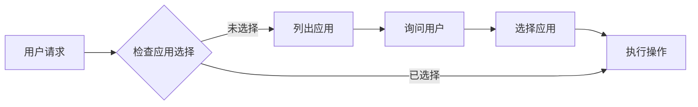

# TapTap Open API MCP 服务器

> 基于 Model Context Protocol (MCP) 的 **TapTap 小游戏和 H5 游戏**服务器，提供排行榜、分享、多人联机、云存档，以及当前游戏 DC 数据查询、统计概览与评价操作能力，并支持 **OAuth 2.0 零配置认证**。

🔐 **零配置 OAuth** | 📚 **完整文档** | 🎯 **丰富 Tools & Resources** | 🌍 **小游戏 & H5** | 📦 **单文件 Bundle**

## ✨ 核心特性

- **🔐 零配置认证** - OAuth 2.0 Device Code Flow，扫码即用
- **📖 完整 API 文档** - 6 个排行榜 API + 详细代码示例
- **⚙️ 服务端管理** - 创建/管理排行榜，自动处理 ID
- **🎮 H5 游戏支持** - 上传、发布、状态查询
- **🧭 当前游戏 DC 能力** - 商店/评价/社区统计概览、商店快照、论坛内容、评价列表、评价点赞、官方回复
- **🦞 OpenClaw Plugin** - 提供一个原生 OpenClaw plugin 子包，内部复用 TapTap MCP 运行时并暴露 raw JSON 工具 + bundled skill
- **🚀 三种传输模式** - stdio（本地）、SSE（远程/实时）、HTTP（兼容）
- **🔌 多客户端并发** - 独立会话管理，无限并发
- **📦 单文件 Bundle** - 零依赖，包体积减少 96%（567 KB）
- **🤖 智能引导** - AI Agent 自动验证前置条件，主动询问用户选择

**NPM**: [@taptap/instant-games-open-mcp](https://www.npmjs.com/package/@taptap/instant-games-open-mcp)
**Maker NPM**: [@taptap/maker](https://www.npmjs.com/package/@taptap/maker)

## 🦞 OpenClaw Plugin（实验中）

仓库内提供了一个可独立使用的 OpenClaw plugin 子包：

- [`packages/openclaw-dc-plugin`](packages/openclaw-dc-plugin)

这个子包的设计目标是：

- 让 OpenClaw 用户只安装一个 plugin
- plugin 内部复用 `@taptap/instant-games-open-mcp` 运行时
- 对 OpenClaw 暴露 raw JSON 工具
- 同时内置 `taptap-dc-ops-brief` skill，让模型自己做简报解读

说明：

- 主包里的 `*_raw` tools 默认不会暴露给普通 MCP 客户端
- 只有设置 `TAPTAP_MCP_ENABLE_RAW_TOOLS=true` 时才会注册
- OpenClaw plugin 会自动打开这个开关，因此插件用户不需要额外配置

详见：

- [OpenClaw Plugin 说明](docs/OPENCLAW_PLUGIN.md)

## 🛠️ TapTap Maker 本地开发（CLI-first）

Maker 本地开发独立发布为 `@taptap/maker`。首次配置推荐直接运行：

```bash
npx -y @taptap/maker init
```

CLI 负责一次性流程：Git 检查、Python 和 maker-lua-lsp 本地 Lua 诊断环境检查、CLI 登录、
TapTap token 换取、app 列表选择或新建 Maker 项目、Maker Git clone、AI dev kit 准备、MCP 配置写入与基础验证。Python 环境准备连续 3 次失败时，
初始化会暂停在登录、项目拉取和 MCP 配置之前；修复后重新运行 `taptap-maker init`。安装或修改 MCP 配置后，Claude Code /
Codex / Cursor / Trae / OpenCode / WorkBuddy 通常需要重启会话、刷新 MCP 或新开窗口才会出现新的 MCP tools；但当前终端
里的 CLI 初始化流程可以继续完成到 PAT 鉴权和项目绑定。

常用 CLI：

```bash
taptap-maker init
taptap-maker login
taptap-maker doctor
taptap-maker apps --json
taptap-maker install
taptap-maker install --ide codex,cursor,claude,trae,opencode,workbuddy
taptap-maker agents update
taptap-maker upgrade
taptap-maker mcp verify
taptap-maker dev-kit update
```

普通初始化、clone、下载或拉取远端项目的标准命令是 `taptap-maker init`，CLI 会展示 app 列表，
让用户选择已有 app 或 `0`/`new`。`--create` 只用于用户明确要求创建新 Maker 项目的场景。
如果需要创建新 Maker 项目，仍从 `taptap-maker init` 进入。app 列表底部会固定显示
`0. Create a new Maker project`，输入 `0` 或 `new` 后填写项目名称；自动化场景可用
`taptap-maker init --create --name "my-local-game"`。当前目录已绑定 Maker 项目时，不允许在同一目录
创建并覆盖绑定；请先切到一个新的独立目录再运行 `taptap-maker init`。

`taptap-maker login` 是 CLI 登录入口；它会按需打开 Maker 授权页，CLI 轮询授权结果并完成本地鉴权配置。
`taptap-maker init` 缺 PAT 时会自动进入该流程。`taptap-maker pat set` 保留为兼容入口；
自动化场景可用 `--pat-stdin` 从标准输入读取。`taptap-maker install` 是
`taptap-maker mcp install` 的快捷别名，二者都会写入 AI 客户端 MCP 配置。
默认会写入 Codex、Cursor、Claude，并自动检测本机已有的 Trae、OpenCode、WorkBuddy
配置文件；命中后会合并安装 `taptap-maker`。Trae Solo 是重点支持目标，CLI 会在 Solo
或 Solo CN 的 `User/` 目录存在时创建或合并 `User/mcp.json`；普通 Trae/Trae CN 仍作为
候选路径保留，但只有 `mcp.json` 已存在时才合并写入。WorkBuddy 在 macOS 和 Windows 都优先写
用户目录下的 `.workbuddy/mcp.json`；显式传 `--ide workbuddy` 时会创建该官方配置文件。
未显式指定 IDE 的自动检测模式下，legacy `.workbuddy/.mcp.json` 仅在官方配置文件不存在且
自身已存在时作为 fallback 合并；写入的 WorkBuddy MCP server 会包含 `disabled: false`。
WorkBuddy 账号维度的启用/信任状态在 `.workbuddy/connectors/<account-id>/connector-states.json`
中维护，不在 `mcp.json` 中；CLI 只做只读诊断，并在 `mcp install --ide workbuddy`
和 `doctor` 输出中提示用户到 WorkBuddy MCP 设置里启用/信任 `taptap-maker`，不会自动修改账号
信任状态。OpenCode 只在 `~/.config/opencode/opencode.jsonc` 已存在时写入。
其它 AI 编辑器可按下面的通用 `mcpServers` 片段，让本地 AI 识别自己的配置文件位置后合并写入：

```json
{
  "mcpServers": {
    "taptap-maker": {
      "command": "npx",
      "args": ["-y", "-p", "@taptap/maker", "taptap-maker"]
    }
  }
}
```

TapTap Maker 的用户配置不需要设置服务环境。预览、构建、测试二维码和本地开发都使用官方服务配置。

`taptap-maker init` 默认写入不带项目 `cwd` 的用户级 MCP 配置；支持 MCP Roots 的客户端
会用当前 workspace root 识别 Maker 项目，避免多个客户端或多个项目互相覆盖 cwd。需要兼容
不支持 Roots 的客户端时，可显式运行 `taptap-maker mcp install --target-dir <PROJECT_DIR>`。
`taptap-maker upgrade` 会刷新当前机器的 Maker MCP 配置，并在当前目录已绑定 Maker 项目时
同步项目 `AGENTS.md` 的 TapTap Maker 受管策略块。`maker://status`、`maker_status_lite`
和 `taptap-maker doctor` 会检查老项目 `AGENTS.md` 是否缺失或过期，并提示运行
`taptap-maker agents update` 或 `taptap-maker upgrade`。
`taptap-maker dev-kit update` 会检查当前环境可用的最新 AI dev kit 并更新当前目录。

如果 Maker MCP tools 缺失或出现 `-32000` / `Connection closed`，先按
[TapTap Maker MCP 本地连接自检与修复指引](docs/MAKER_MCP_CONNECTION_TROUBLESHOOTING.md)
检查本地客户端配置、信任状态、cwd、Node/npm/npx 和启动日志。MCP 未连接时不要依赖 MCP tools 自检。

Maker MCP 精简为开发循环里的高频能力：

```text
maker://status                  # Resource，读取本地 Maker 状态
maker_status_lite               # Resource 不可用时的兼容 tool
maker_build_current_directory   # commit/push/build 合并入口
```

在已绑定 Maker 项目中，`maker_build_current_directory` 同时覆盖“构建 / 预览 / 跑一下 /
查看结果 / 看看效果 / 验证游戏效果 / 提交 / 推送”。普通“验证代码 / 跑测试 / lint /
检查实现”不应自动触发 Maker 远端构建，除非用户明确要求构建、运行或预览 Maker 游戏。
普通构建会先 push 到 Maker 远端再触发远端 build：本地有改动时提交改动，已有未推送 commit 时
直接 push，本地干净且没有未推送 commit 时创建 `chore: wake maker build server` 空提交来唤醒远端
服务。push 失败时不会继续 build，会返回本地 commit、ahead 状态、stderr/stdout 和下一步建议，
交给本地 Agent/skill 处理 pull、rebase 或冲突；push 成功但 build 失败时，会明确说明代码已到
Maker 远端但构建失败。只有用户明确说“不提交，只构建云端版本”时，才传
`confirm_remote_build_without_submit=true`；该模式只构建 Maker 远端已提交版本，不会自动打开
Maker 页面。

构建成功后，Maker MCP 会刷新 Maker Web 预览，并启动本地 runtime log watcher。后续如果用户询问
游戏运行结果、Lua 报错或调试问题，本地 AI Agent 应优先读取构建返回中的
`runtime_logs.local_file`；如需判断 watcher 是否正常，读取 `runtime_logs.state_file`。

Maker MCP 也提供部分远端 proxy 能力，当前包括 `generate_image`、`batch_generate_images`、
`edit_image`、`create_video_task`、`query_video_task`、`text_to_music`、
`text_to_sound_effect`、`batch_sound_effects`、`text_to_dialogue`、
`audition_voices_for_character`、`confirm_character_voice`、`create_3d_asset`、
`generate_test_qrcode`、`get_ad_config` 和 `get_debug_feedbacks`；具体参数以 MCP 客户端展示的
tool schema 为准。
已绑定 Maker 项目中建议优先使用这些 proxy tools；其中 `get_debug_feedbacks` 会拉取线上玩家反馈，
并在可下载附件存在时保存日志和截图到当前 Maker 项目的 `logs/feed_back/feedback_<id>/`，
返回 `local_dir` / `local_log_paths` / `local_screenshot_paths` 等本地路径。代理转发、错误透出和白名单细节见
[TapTap Maker 本地开发](docs/MAKER.md)。
音频 tools 支持音效、角色试听、音色确认和配音；生成音频以及确认后的参考音频会保存到
当前本地 Maker 项目。

Windows 是默认优先级：CLI 写通用 `mcpServers` 配置时会在 Windows 通过 `cmd.exe`
包装 `npx.cmd`，避免无 shell 的 MCP 启动器直接 spawn `.cmd` 失败；OpenCode 使用自己的
`mcp` schema 和 command 数组，在 Windows 下写入 `npx.cmd`，不写环境变量；Git 引导优先提示 Git for Windows，
并要求安装选项允许命令行和第三方工具通过 PATH 找到 Git。macOS 用户可通过 `git --version`
触发 Xcode Command Line Tools，或安装官方 Git。

详见：[TapTap Maker 本地开发](docs/MAKER.md)。面向团队介绍的功能总览见
[Maker CLI + MCP + Skill Rework Overview](docs/MAKER_CLI_MCP_SKILL_REWORK_OVERVIEW.md)。

本地 Maker MCP 会透明上报本地开发活跃事件，复用 `tapmaker_mcp_call` 并在
`args.source` 写入 `local_mcp`，在 `args.mcp_version` 写入当前 `@taptap/maker`
版本；普通开发构建使用 `dev`，不会使用主包版本代替。事件只使用当前绑定项目配置中的
`user_id` 和 `project_id`；任一关键字段缺失或项目上下文无法准确解析时跳过上报，不使用
默认值或其它账号信息代替。Tool、`maker://status` Resource 和 MCP 启动事件均可作为
活跃行为，上报失败不会影响 MCP 工具结果。

## 🧩 Codex Skills（运营简报）

本仓库内置一个面向运营/工作室的 Codex Skill：`taptap-dc-ops-brief`，用于把“当前游戏 DC 数据”整理成 30 秒可读的结论简报，并在你确认后执行评价点赞/官方回复等动作。

### 安装到 Codex

在已安装 Codex 的机器上运行：

```bash
python3 ~/.codex/skills/.system/skill-installer/scripts/install-skill-from-github.py \
  --repo taptap/instant-games-open-mcp \
  --path skills/taptap-dc-ops-brief
```

安装完成后重启 Codex，即可在对话中使用：

> 使用 `$taptap-dc-ops-brief` 生成当前游戏的 7 日运营简报，并给出是否建议点赞/回复评价（先出草稿，等我确认再发）。

## 🚀 快速开始

> 🐣 **完全不懂技术？** [快速开始（零基础版）](docs/QUICK_START.md) - 3 分钟搞定 Cursor 配置，复制粘贴就能用。
>
> 📖 **想了解更多配置？** [详细配置指南](docs/USER_GUIDE.md) - Cursor、Claude Code、VS Code、Claude Desktop 等多种工具的配置方法。

### 安装

```bash
# 全局安装
npm install -g @taptap/instant-games-open-mcp

# 或使用 npx 直接运行（无需安装）
npx @taptap/instant-games-open-mcp
```

### 配置（MCP 客户端）

#### Claude Code / VSCode / Cursor

在项目中创建 `.mcp.json`:

```json
{
  "mcpServers": {
    "taptap-minigame": {
      "command": "npx",
      "args": ["-y", "@taptap/instant-games-open-mcp"],
      "env": {
        "TAPTAP_MCP_WORKSPACE_ROOT": "${workspaceFolder}"
      }
    }
  }
}
```

**重要说明**：

- **零配置 OAuth**：首次使用会提示扫码授权，token 自动保存！
- **路径处理**：设置 `TAPTAP_MCP_WORKSPACE_ROOT` 环境变量可以正确解析相对路径（推荐）
  - 如果不设置，相对路径会基于用户 HOME 目录（可能不符合预期）
  - 建议使用绝对路径，或配置 `TAPTAP_MCP_WORKSPACE_ROOT`
- **Windows 启动报 `Received protocol 'c:'`**：这是旧版本 Windows ESM 动态导入路径兼容问题，请升级到包含该修复的最新版本。

#### OpenHands（推荐 SSE 模式）

**远程部署**:

```bash
# 启动 SSE 服务器
TAPTAP_MCP_TRANSPORT=sse TAPTAP_MCP_PORT=3000 \
npx @taptap/instant-games-open-mcp
```

**OpenHands 配置**:

```json
{
  "mcpServers": {
    "taptap-minigame": {
      "url": "http://your-server:3000",
      "transport": "sse"
    }
  }
}
```

✅ SSE 模式支持实时进度推送！

### Docker 部署

```bash
# 快速启动（同时运行 Production 和 RND 环境）
cd docker/npm
docker-compose up -d

# 健康检查
curl http://localhost:5003/health  # Production
curl http://localhost:5002/health  # RND
```

详见: [Docker 部署文档](docker/README.md)

## 📖 功能列表

### 核心 Tools（含当前游戏 DC 能力）

#### 流程指引 (1)

- `get_leaderboard_integration_guide` - 排行榜完整接入工作流指引

#### 信息查询 (3)

- `get_current_app_info` - 获取当前应用信息
- `check_environment` - 检查环境配置
- `get_environment_switch_guide` - 获取 production/RND 环境切换配置指引

#### 认证 (3)

- `start_oauth_authorization` - 开始 OAuth 授权（获取二维码）
- `complete_oauth_authorization` - 完成 OAuth 授权
- `clear_auth_data` - 清除认证数据和缓存

#### 应用管理 (3)

- `list_developers_and_apps` - 列出所有开发者和应用（含关卡与非关卡）
- `select_app` - 选择当前应用（支持关卡与非关卡）
- `create_developer` - 创建新开发者

#### 当前游戏 DC 能力 (8)

- `get_current_app_store_overview` - 获取当前游戏商店统计概览（曝光、下载、预约、下载请求趋势）
- `get_current_app_review_overview` - 获取当前游戏评价统计概览（评分、好中差评、评分趋势）
- `get_current_app_community_overview` - 获取当前游戏社区统计概览（帖子、关注、浏览、趋势）
- `get_current_app_store_snapshot` - 获取当前游戏商店结果型快照
- `get_current_app_forum_contents` - 获取当前游戏论坛内容
- `get_current_app_reviews` - 获取当前游戏评价列表
- `like_current_app_review` - 给当前游戏指定评价点赞
- `reply_current_app_review` - 以官方身份回复当前游戏评价

#### 排行榜管理 (5)

- `create_leaderboard` - 创建排行榜
- `list_leaderboards` - 列出排行榜
- `publish_leaderboard` - 发布排行榜
- `get_user_leaderboard_scores` - 获取用户分数
- `get_app_status` - 获取应用审核状态

#### H5 游戏管理 (3)

- `prepare_h5_upload` - 收集 H5 游戏信息（上传前）
- `upload_h5_game` - 上传 H5 游戏包
- `get_debug_feedbacks` - 拉取用户调试反馈并下载日志/截图

#### 振动 API 文档 (1)

- `get_vibrate_integration_guide` - 振动 API 完整文档和接入指引

### 11 个 Resources

完整的排行榜 API 文档：

- `docs://leaderboard/overview` - 完整概览
- `docs://leaderboard/api/get-manager` - 初始化
- `docs://leaderboard/api/submit-scores` - 提交分数
- `docs://leaderboard/api/open` - 显示 UI
- `docs://leaderboard/api/load-scores` - 加载数据
- `docs://leaderboard/api/load-player-score` - 玩家排名
- `docs://leaderboard/api/load-centered-scores` - 周围玩家

完整的振动 API 文档：

- `docs://vibrate/overview` - 完整概览
- `docs://vibrate/api/vibrate-short` - 短振动 API
- `docs://vibrate/api/vibrate-long` - 长振动 API
- `docs://vibrate/patterns` - 使用模式和最佳实践

## 🎯 使用示例

### 接入排行榜

```
用户: "我想在游戏中接入排行榜"

AI 调用: get_integration_guide
→ 返回完整工作流（创建排行榜 → 客户端代码 → 测试）

AI 调用: create_leaderboard
→ 创建服务端排行榜

AI 读取: docs://leaderboard/api/submit-scores
→ 获取客户端代码示例
```

### OAuth 授权（首次）

```
AI 调用: create_leaderboard
→ 🔐 需要授权，显示二维码链接

用户: 扫码后告知 "已授权"

AI 调用: complete_oauth_authorization
→ ✅ 授权完成，token 已保存

AI 调用: create_leaderboard
→ ✅ 排行榜创建成功
```

## 🛠️ 开发

### 环境要求

- Node.js 18.14.1+
- npm 或 pnpm

### 本地开发

```bash
# 安装依赖
npm install

# 启动开发服务器
npm run dev

# 构建
npm run build

# 运行测试
npm test
```

### Maker 本地开发预览

Maker 本地开发现在以 CLI-first 为准。初始化、PAT、app 选择/创建、dev-kit 和 clone 都走 CLI；MCP 只保留状态和同步构建：

```text
taptap-maker init
taptap-maker doctor
taptap-maker apps
taptap-maker mcp verify
maker://status
maker_status_lite
maker_build_current_directory
```

`taptap-maker doctor` 会检查 Git、Python 环境、maker-lua-lsp、PAT、TapTap token、项目绑定、
AI dev kit 版本和 MCP 配置。`maker://status` 和 `maker_status_lite` 会输出
`MCP client roots` 与 `project_context_source`，用于确认当前项目来自客户端 workspace roots
还是 MCP cwd fallback。若 Git 不可用，clone/push 会直接停止，直到用户自行安装 Git 并通过
`git --version` 验证。
已绑定项目还会执行轻量的统一项目结构检查：检查 `.project/project.json`、
`.project/resources.json`、`.project/settings.json`，识别配置被 AI 删除或移动到项目根目录、
以及已知 `assets/project.json` 错位的情况。根目录候选只有在匹配 Maker `$schema` 或完整的
`project.json` 发布字段组合时才会判定为错位；普通同名业务文件不会阻断构建。`.project` 不存在时跳过内部配置检查；`dist` 是
构建产物，不参与源配置有效性判断。构建会在 commit/push 前阻断明确的路径或 JSON 错误，
`generate_test_qrcode` 会在远端调用前检查最小项目配置，但不会自动搬运或覆盖本地文件。
健康检查本身保持只读；需要修复时，AI 应优先从 Git 或完整的错位副本恢复文件。只有在
`settings.json` 仍是可解析 object 时，才可恢复 `$schema` 和构建固定字段（资源 tag 仅从完整副本恢复），
并保留 `@runtime` 与未知字段；不要凭默认值重建 `project_id`、入口、版本、发布信息或资源分组。
在用户确认后，可以只补入缺失且不会覆盖意图的 settings 默认字段：`output_dir=../dist`、
`asset_dirs=["../assets","../scripts"]`、`generate_fs_path=true`、`asset_ignores=[]`，
以及 schema 中的 `assets_7z_threshold=50`、`preload_include_refs=true`、
`trim_remote_refs=true`、`legacy_binary=false`、`tags={}`；已有非默认值不得覆盖。
`sources.*.tag`、项目身份、版本、入口、发布信息和 resources 分组只允许从完整副本恢复。
`taptap-maker mcp verify` 默认跑一次实际 MCP 配置使用的 npx 包命令；本地 dist 自测可用 `--mode self`。如果失败结果显示 `failure_type` 或 `status: null`，优先按本地 Node/npm/npx 启动问题处理，Maker MCP server 此时尚未启动，不要误判为 PAT 或 Maker 服务报错。

测试时优先运行 `taptap-maker login`；CLI 会按需打开 Maker 授权页，授权完成后自动完成本地鉴权配置。
当前目录未绑定时，APP_ID 应通过 `taptap-maker init` 或 `taptap-maker apps` 返回的 app 列表让用户选择；
创建新项目时使用 `taptap-maker init` 列表底部的 `0. Create a new Maker project`，或运行
`taptap-maker init --create --name "my-local-game"`；checkout 完成后会补齐 `assets/image`、
`assets/sprites`、`assets/video`、`assets/audio` 和 `scripts` 基础目录；当前目录已绑定时不要再次引导 clone 或创建新项目。

```bash
npm run build
npx @modelcontextprotocol/inspector node dist/maker.js
```

详细说明见 [docs/MAKER.md](docs/MAKER.md)。

### 环境变量

**OAuth 认证（推荐）**:

- 无需配置！自动保存 token 到 `~/.config/taptap-minigame/`

**手动配置（可选）**:

- `TAPTAP_MCP_MAC_TOKEN` - MAC Token（JSON 格式）
- `TAPTAP_MCP_CLIENT_ID` - 客户端 ID（非必需，不配置会导致部分工具无法使用）
- `TAPTAP_MCP_CLIENT_SECRET` - 签名密钥（非必需，不配置会导致部分工具无法使用）

**其他**:

- `TAPTAP_MCP_ENV` - 环境：`production`（默认）或 `rnd`
- `TAPTAP_MCP_DC_CURRENT_APP_BASE_URL` - 当前游戏 DC 接口 host 覆盖（可选，路径仍为 `/mcp/v1/current-app/...`）
- `TAPTAP_MCP_TRANSPORT` - 传输模式：`stdio`（默认）、`sse`、`http`
- `TAPTAP_MCP_PORT` - 端口（默认 3000）
- `TAPTAP_MAKER_CRASH_LOG_MAX_BYTES` - Maker MCP 崩溃日志 `~/.taptap-maker/mcp-crash.log` 上限，默认 1 MiB
- `TAPTAP_MAKER_CRASH_LOG_MAX_ENTRY_BYTES` - Maker MCP 单条崩溃日志上限，默认 16 KiB
- `TAPTAP_MCP_VERBOSE` - 详细日志：`true` 或 `false`
- `TAPTAP_MCP_CACHE_DIR` - 缓存目录（默认 `/tmp/taptap-mcp/cache`）
- `TAPTAP_MCP_TEMP_DIR` - 临时文件目录（默认 `/tmp/taptap-mcp/temp`）

**日志配置**:

- `TAPTAP_MCP_LOG_ROOT` - 日志根目录（默认 `/tmp/taptap-mcp/logs`）
- `TAPTAP_MCP_LOG_FILE` - 启用文件日志：`true` 或 `false`（默认 `false`）
- `TAPTAP_MCP_LOG_LEVEL` - 日志级别（RFC 5424）：`debug`、`info`、`notice`、`warning`、`error`、`critical`、`alert`、`emergency`（默认 `info`）
- `TAPTAP_MCP_LOG_MAX_DAYS` - 日志保留天数（默认 7）

详细说明请参考 [docs/LOG_SYSTEM.md](docs/LOG_SYSTEM.md)

### 环境切换帮助

如果需要在 AI 对话中切换测试环境，可以让 AI 调用
`get_environment_switch_guide` 查看配置示例，再更新 MCP 客户端配置中的 `env` 字段。
RND 环境需要显式配置 `TAPTAP_MCP_CLIENT_ID` 和 `TAPTAP_MCP_CLIENT_SECRET`，
production 通常使用内置 native signer，无需额外配置。

### 添加新功能

```bash
# 使用脚手架
./scripts/create-feature.sh

# 按提示输入功能信息
# 自动生成模块结构到 src/features/yourFeature/
```

## 🤖 AI Agent 智能引导

本服务器经过精心设计，通过工具描述引导 AI Agent 提供更智能的用户体验：

### 自动前置条件检查

AI Agent 会在执行排行榜操作前，自动检查是否已选择应用：

```
用户: "创建一个排行榜"

AI: 让我先检查当前是否已选择应用...
    [调用 get_current_app_info]

    发现尚未选择应用，我来帮您列出可用的应用：
    [调用 list_developers_and_apps]

    请问您想为哪个应用创建排行榜？
    共 200 个应用，当前先展示前 40 个；如果没有看到目标应用，
    可以继续查看更多，或提供 App ID/名称关键词继续定位。
    如果客户端宽度足够，可以把预览整理成两列紧凑布局；窄屏保持单列。
    1. 游戏 A (Developer: 开发者A, App ID: 12345)
    2. 游戏 B (Developer: 开发者B, App ID: 67890)
```

### 主动询问用户选择

当有多个选项时，AI Agent 会主动展示列表并询问用户：

```
用户: "查看排行榜"

AI: 您有以下几个排行榜：
    1. 每日高分榜 (ID: lb_001)
    2. 周排行榜 (ID: lb_002)
    3. 全服总榜 (ID: lb_003)

    请问您想查看哪一个？
```

### 工作流程自动优化

AI Agent 会自动引导用户完成必要的步骤，避免操作失败：



**受益场景：**

- 创建/查询排行榜
- 发布排行榜
- 上传 H5 游戏
- 所有需要应用上下文的操作

**技术实现：**
通过在工具描述中使用 `**PREREQUISITE:**`、`**CRITICAL:**`、`**IMPORTANT:**` 等关键词，以及明确的步骤指导，让 AI Agent 理解何时需要检查前置条件、何时应该询问用户。

详见：[CLAUDE.md - AI Agent 工具使用指导](CLAUDE.md#ai-agent-工具使用指导)

## 📚 文档

### 用户文档

- **[docs/USER_GUIDE.md](docs/USER_GUIDE.md)** - 🐣 新手配置指南（Cursor/VS Code/Claude Code）
- **[CONTRIBUTING.md](CONTRIBUTING.md)** - 贡献指南
- **[CHANGELOG.md](CHANGELOG.md)** - 版本变更历史

### 技术文档

- **[docs/ARCHITECTURE.md](docs/ARCHITECTURE.md)** - 架构文档
- **[docs/DEPLOYMENT.md](docs/DEPLOYMENT.md)** - 部署指南（本地、Docker、开发者测试）
- **[docs/PROXY.md](docs/PROXY.md)** - MCP Proxy 开发指南（面向 TapCode 等平台）
- **[docs/PATH_RESOLUTION.md](docs/PATH_RESOLUTION.md)** - 路径解析系统

## 🤝 贡献

欢迎贡献！请遵循：

1. Fork 仓库并创建 feature 分支
2. 使用 Conventional Commits 规范
3. 创建 PR，等待 CI 检查
4. Review 通过后合并

## 📄 许可证

MIT

## 🔗 相关链接

- [TapTap 开发者中心](https://developer.taptap.cn/)
- [官方 API 文档](https://developer.taptap.cn/minigameapidoc/dev/api/open-api/leaderboard/)
- [MCP 协议规范](https://modelcontextprotocol.io/)
- [Issues](https://github.com/taptap/instant-games-open-mcp/issues)
