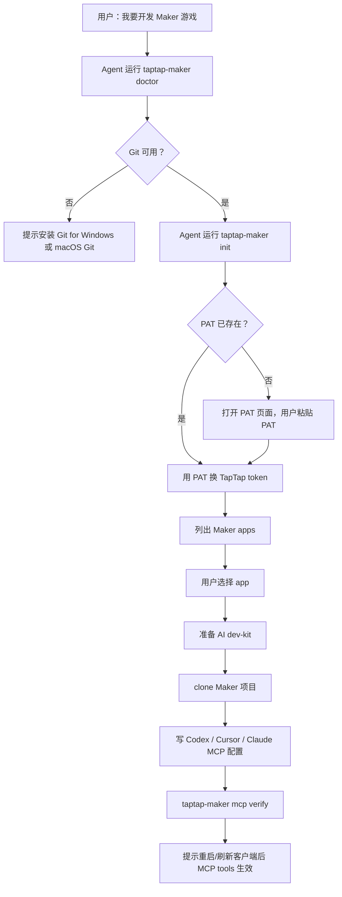
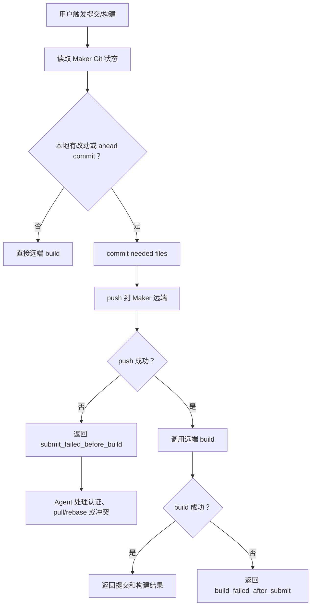

# Maker CLI-First Rework Flow

本文档记录本次 Maker 本地开发重构的业务流程、边界和验证顺序。它用于两类场景：

- 上下文压缩后继续开发，避免忘记已经做过的决策。
- 用户做实际体验反馈时，对照每一步应该发生什么。

## 一句话结论

Maker 本地开发改为：

```text
一次性初始化：CLI + skill
高频开发循环：MCP status resource + merged build tool
```

不要把 PAT、app 列表、clone、dev-kit 下载继续暴露成公开 MCP tools。那些都是低频、一次性、强本地环境相关流程，更适合 CLI 和 skill。

## 角色边界

### CLI

CLI 负责所有本地一次性工作：

- 检查 Git。
- 保存 Maker PAT。
- 用 PAT 换 TapTap token。
- 拉取 Maker app 列表。
- 让用户选择 app。
- 检查目标目录是否适合 clone。
- 准备 AI dev-kit。
- clone Maker Git 仓库。
- 写 AI 客户端 MCP 配置。
- 验证本机启动命令。

主要命令：

```bash
taptap-maker init
taptap-maker doctor
taptap-maker apps
taptap-maker pat set <PAT>
taptap-maker mcp install
taptap-maker mcp verify
taptap-maker dev-kit update
```

### MCP

MCP 只保留开发循环需要的能力：

```text
maker://status
maker_status_lite
maker_build_current_directory
```

`maker://status` 是首选状态入口。`maker_status_lite` 只用于客户端不能读 MCP resource 的兼容场景。

MCP status 可以读本地状态，也可以在已有 PAT 但缺 TapTap token 时尝试刷新 token；但不应该下载 dev-kit、clone 项目或写客户端配置。

### Skill

Skill 负责 Agent 决策和用户解释：

- 用户说“我要开发 Maker 游戏”时，引导运行 `taptap-maker init`。
- 用户说“提交 / push / 构建 / 预览 / 跑一下 / 验证一下”时，在 Maker 项目里调用 `maker_build_current_directory`。
- push 失败时，解释原因、识别冲突文件、让用户确认 pull/rebase/修复策略。
- 不绕回通用 Git PR/任务号工作流。

## 用户初始化流程

标准新用户流程：



关键体验要求：

- 不要求用户手动提供 `app_id`。
- app 列表必须逐项展示，不要只说“共有 N 个”。
- 目录已有普通文件时，要解释 clone 会保留本地文件，但同路径冲突会失败。
- 目录在外层 Git 仓库下时，推荐新建独立目录。
- Windows 用户优先提示 Git for Windows 和 PATH 选项。

## 开发循环流程

用户常见话术：

```text
帮我提交
提交代码
提交并推送
push
构建
预览
跑一下
验证一下
看看效果
```

统一走：

```text
maker_build_current_directory
```

流程：



重点：

- push 失败时不启动远端 build，避免构建云端旧版本。
- push 失败后不要手动走通用 `git push`，重试同一个 Maker build 工具。
- push 成功但 build 失败时，要明确告诉用户“代码已提交到 Maker 远端，但构建失败”。
- 用户明确说“不提交，只构建云端版本”时，才设置 `confirm_remote_build_without_submit=true`。

## MCP 安装和当前会话限制

AI 客户端通常在会话启动时加载 MCP 配置。因此：

- CLI 可以在当前终端继续完成 PAT、app 选择、dev-kit 和 clone。
- CLI 可以写 MCP 配置。
- 新增或修改后的 MCP server 通常要客户端刷新 MCP、重启会话或新开窗口后才出现在工具列表里。

这点不能靠 npm 包本身完全绕过。可行的用户体验是：

```text
先用 CLI 完成初始化和项目绑定
再提示用户刷新/重启客户端让 MCP 开发循环生效
```

不要承诺“安装后无需任何客户端刷新就能把新 MCP tool 注入当前 Agent 会话”。

## Windows 优先事项

Windows 是默认优先级，所有后续迭代要先考虑 Windows：

- MCP 配置 command 使用 `npx.cmd`。
- Git 引导优先使用 Git for Windows。
- 提醒安装时选择让命令行和第三方工具能从 PATH 找到 Git。
- 路径处理必须用 Node `path` API。
- 不手写 POSIX 路径分隔符。
- 不依赖 macOS/Linux 专有命令完成核心流程。

Windows 手工冒烟建议：

```powershell
node dist\maker.js help
node dist\maker.js doctor --json --target-dir .
node dist\maker.js mcp verify --json
npx -y -p @taptap/instant-games-open-mcp taptap-maker init
```

## 本地验证命令

每次修改 CLI/MCP 代码后至少跑：

```bash
npm run lint
npm run build
npm test -- makerBuildLocalChanges.test.ts --runInBand
node dist/maker.js help
node dist/maker.js mcp verify --json
```

MCP smoke：

```bash
node -e "import('@modelcontextprotocol/sdk/client/index.js').then(async ({Client})=>{const {StdioClientTransport}=await import('@modelcontextprotocol/sdk/client/stdio.js'); const transport=new StdioClientTransport({command:'node',args:['dist/maker.js']}); const client=new Client({name:'smoke',version:'1.0.0'},{capabilities:{}}); await client.connect(transport); const tools=await client.listTools(); const resources=await client.listResources(); const status=await client.readResource({uri:'maker://status'}); console.log(JSON.stringify({tools:tools.tools.map(t=>t.name),resources:resources.resources.map(r=>r.uri),statusPrefix:status.contents?.[0]?.text?.slice(0,32)})); await client.close();})"
```

期望输出：

```json
{
  "tools": ["maker_status_lite", "maker_build_current_directory"],
  "resources": ["maker://status"],
  "statusPrefix": "TapTap Maker MCP status\n- versio"
}
```

## 禁止回退的旧流程

不要在公开 MCP surface 里恢复这些工具：

```text
maker_exchange_pat
maker_list_apps
maker_clone_to_current_directory
maker_submit_current_directory
maker_status
```

不要在文档里继续指导 Agent 调用：

```text
submit_local_changes_before_build=true
remember_build_submit_preference=true
```

这些是旧的“build 拦截后再询问偏好”的流程。现在默认就是同步后构建。

## 当前已知缺口

- 用户已反馈本机和 Windows 自测流程跑完，主流程没有问题。
- `init --resume` 没有暴露，当前只有 keyed state 供后续迭代。
- `taptap-maker mcp install` 会写真实用户配置，本仓库开发会话里不要随便运行。

## 继续开发时的最短恢复步骤

```bash
git status --short --branch
sed -n '1,260p' docs/superpowers/plans/2026-05-25-maker-cli-first-rework.md
sed -n '1,260p' docs/MAKER_CLI_FIRST_REWORK_FLOW.md
```

然后确认：

- 当前是否还在 `codex/maker-cli-first-rework`。
- 最近用户反馈的是 CLI 初始化、MCP tool surface、build/submit 合并，还是 Windows 冒烟。
- 是否需要修改文档、代码或只解释体验。
