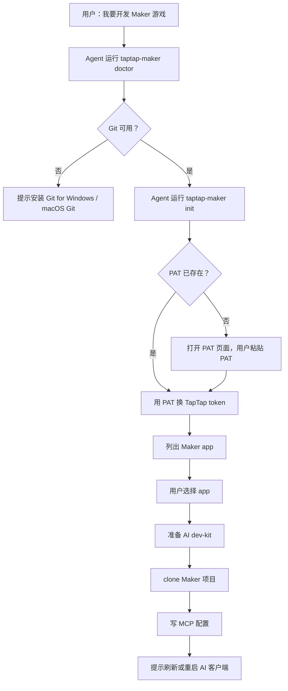
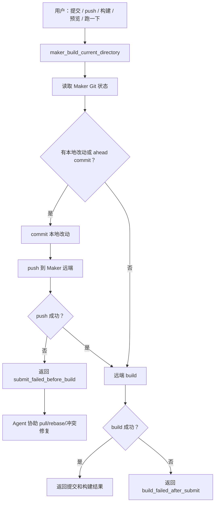

# TapTap Maker CLI + MCP + Skill 重构功能介绍

本文档用于向团队介绍本轮 Maker 本地开发体验重构后的功能、流程和结果。目标读者包括产品、后端、AI Agent 流程维护者和需要参与灰度验证的同学。

## 一句话总结

Maker 本地开发从“所有能力都塞进 MCP tools”调整为：

```text
CLI 负责一次性初始化
MCP 负责高频开发循环
Skill 负责 Agent 决策和失败恢复
```

这次重构的核心目标是降低用户首次配置成本，减少 Agent 误调用工具的概率，并让“提交、推送、远端构建”在用户感知里成为一个完整操作。

## 为什么要重构

一阶段流程已经跑通，但真实使用暴露出几个问题：

- 初始化链路很长：安装 MCP、检查环境、准备 dev-kit、PAT 校验、app 选择、clone 都混在 MCP tools 里。
- 这些动作大多是一次性低频操作，不适合作为长期暴露给 Agent 的 MCP tool surface。
- 用户通常会把文档丢给 Codex / Claude Code / Cursor，让 Agent 配置 MCP，但 MCP 配置变更通常需要刷新或重启当前客户端会话。
- `maker_build` 和 `maker_submit` 在用户感知里不是两个操作。用户说“提交”“push”“跑一下”“预览”时，实际期望都是：本地改动提交到 Maker，再触发远端构建。
- Windows 用户占比高，原流程需要更明确地处理 `npx.cmd`、Git for Windows、PATH 和 PowerShell 使用习惯。

## 重构后的职责划分

### CLI：本地一次性初始化入口

CLI 负责所有与本机环境、账号、项目绑定相关的低频动作：

| 命令                          | 作用                                                                          |
| ----------------------------- | ----------------------------------------------------------------------------- |
| `taptap-maker init`           | 一站式初始化：Git 检查、PAT、TapTap token、app 选择、dev-kit、clone、MCP 配置 |
| `taptap-maker doctor`         | 检查 Git、PAT、TapTap token、项目绑定、dev-kit、skill 状态                    |
| `taptap-maker apps`           | 使用 PAT 获取 Maker app 列表                                                  |
| `taptap-maker pat set`        | 交互式保存 Maker PAT，并换取 TapTap token                                     |
| `taptap-maker mcp install`    | 写入 Codex / Cursor / Claude 的 MCP 配置                                      |
| `taptap-maker mcp verify`     | 验证当前 CLI 是否可被 spawn                                                   |
| `taptap-maker dev-kit update` | 恢复或更新本地 AI dev-kit                                                     |

设计原则：

- 不新增运行时依赖，第一版使用 Node 内置能力完成交互和配置写入。
- 本地分支测试可直接用 `node dist/maker.js`，不依赖 npm 发布。
- Windows 下生成 MCP 配置时自动使用 `npx.cmd`。
- 初始化失败时保留现场，返回可重试状态，不自动删除用户文件。
- Git clone/fetch 遇到 503、HTTP 5xx、超时、连接重置、RPC/HTTP2 中断等临时错误时自动重试；认证、权限、仓库不存在、远端拒绝和本地目录冲突不重试，直接返回明确分类。
- 首次 clone/fetch 前主动提示 Maker server 可能正在准备仓库，首次拉代码 20 秒以上是正常现象，避免用户误以为卡住后中断命令。

### MCP：收敛为开发循环能力

MCP 只保留高频、运行期需要的能力：

| MCP 能力                        | 类型     | 作用                              |
| ------------------------------- | -------- | --------------------------------- |
| `maker://status`                | Resource | 首选状态入口，读取本地 Maker 状态 |
| `maker_status_lite`             | Tool     | Resource 不可用时的兼容状态工具   |
| `maker_build_current_directory` | Tool     | 提交、推送、远端构建的统一入口    |

不再公开的旧工具：

```text
maker_exchange_pat
maker_list_apps
maker_clone_to_current_directory
maker_submit_current_directory
maker_status
```

`maker://status` 只做状态读取，不再下载 dev-kit、clone 项目或写客户端配置。dev-kit 修复交给 `taptap-maker dev-kit update`。

### Skill：Agent 工作流和失败恢复层

Skill 不做底层 API 调用，而是负责告诉 Agent 该怎么走流程：

- `taptap-maker-local`：初始化、状态解释、提交/构建、pull/rebase、冲突处理。
- `taptap-maker-dev-kit-guide`：解释 `CLAUDE.md`、`examples/`、`templates/`、`urhox-libs/` 的用途。
- `update-taptap-mcp`：更新本地 npx 缓存，并提醒刷新/重启客户端。

重构后，Skill 的关键行为是：

- 用户要初始化 Maker 项目时，转给 `taptap-maker init`。
- 用户要提交、push、构建、预览、跑一下时，统一调用 `maker_build_current_directory`。
- push 失败时，不走通用 Git PR / 任务号流程，不手动执行 generic `git push`，而是解释失败原因并协助用户 pull/rebase 或解决冲突后重试 Maker build 工具。
- Git 失败返回 `classification`、`retryable`、`retry_reason` 和重试次数，Skill 据此判断是建议稍后重试、刷新 PAT、pull/rebase，还是处理本地目录冲突。

## 主流程

### 首次初始化流程



用户感知：

```text
安装配置好后，继续 PAT 校验
校验成功后展示 app 列表
选择 app 后自动准备本地项目
刷新/重启客户端后进入开发循环
```

### 开发循环流程



关键约束：

- push 失败时不启动远端 build，避免构建云端旧版本。
- push 成功但 build 失败时，要明确告诉用户代码已提交到 Maker 远端。
- 用户明确说“不提交，只构建云端版本”时，才使用 `confirm_remote_build_without_submit=true`。

## MCP 配置和当前会话限制

这次没有承诺“安装 MCP 后当前 Agent 会话立即出现新 tools”。原因是大多数 AI 客户端在会话启动时加载 MCP 配置。

重构后的体验设计是：

```text
CLI 先完成初始化、PAT、app 选择、clone
然后提示用户刷新/重启客户端
客户端重新加载后，MCP 只负责状态和构建循环
```

这样即使当前对话不能热加载新 MCP，用户也可以继续完成最关键的 PAT 校验和项目绑定。

## Windows 优先支持

本轮重构按 Windows 优先做了这些约束：

- MCP 配置 command 在 Windows 使用 `npx.cmd`。
- Git 安装引导优先提示 Git for Windows。
- 提醒用户安装时确保命令行和第三方工具可从 PATH 找到 Git。
- 代码路径处理使用 Node `path` API，不手写 POSIX 分隔符。
- 本地测试文档提供 PowerShell 命令。

## 验证结果

已完成验证：

- 本机 CLI 自测流程通过。
- Windows 自测流程通过。
- MCP surface smoke 通过。
- `maker_build_current_directory` 合并提交/推送/构建的关键测试通过。

本地自动验证命令：

```bash
npm run lint
npm run build
npm test -- makerBuildLocalChanges.test.ts makerSkillInstall.test.ts makerProjectsResponse.test.ts makerCrashLog.test.ts --runInBand
node dist/maker.js help
node dist/maker.js mcp verify --json
```

测试结果：

```text
4 test suites passed
44 tests passed
MCP tools: maker_status_lite, maker_build_current_directory
MCP resources: maker://status
```

## 重构收益

### 对用户

- 首次配置路径更像一个完整安装向导。
- 不需要理解一堆 MCP tools 的调用顺序。
- “提交 / push / 构建 / 预览”统一为一个操作。
- push 失败时不会误构建云端旧版本。

### 对 Agent

- MCP tool surface 大幅变小，误调用概率降低。
- 一次性初始化交给 CLI，Agent 只负责解释和决策。
- 失败恢复路径更明确：push 失败先解决 Git 状态，再重试同一个 Maker build 工具。

### 对维护

- CLI、MCP、Skill 边界清晰。
- 后续可单独迭代 CLI 体验，不必扩大 MCP public surface。
- Windows 行为有单独测试和文档约束。

## 后续迭代建议

短期：

- 根据真实用户反馈优化 `taptap-maker init` 的交互文案。
- 评估是否需要正式暴露 `init --resume`。
- 增加更友好的 app 选择展示，例如按最近编辑时间排序。

中期：

- 根据 Codex / Claude Code / Cursor 的 MCP Resource 支持情况，评估是否保留 `maker_status_lite`。
- 如果客户端支持热刷新 MCP，补充更短的 reload 指引。
- 把 Windows 真机 smoke 固化成发布前检查清单。

长期：

- 保持 MCP 小而稳定，避免把一次性流程重新塞回 MCP tools。
- CLI 作为 Maker 本地开发入口继续承载安装、迁移、诊断和修复能力。
