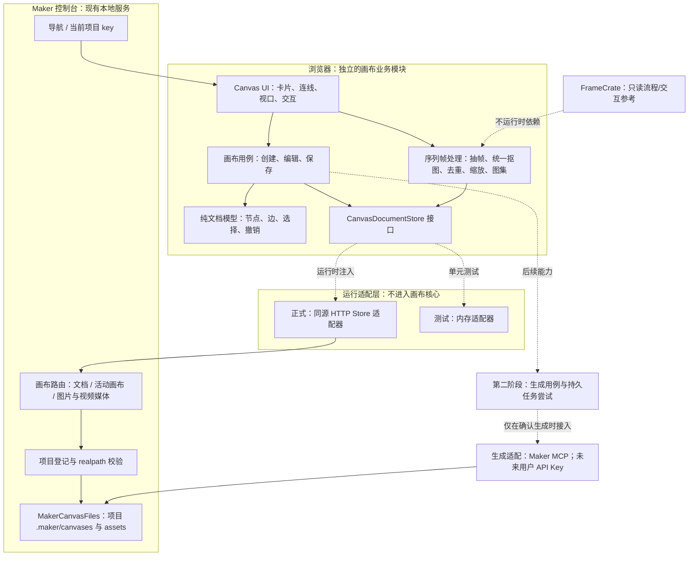
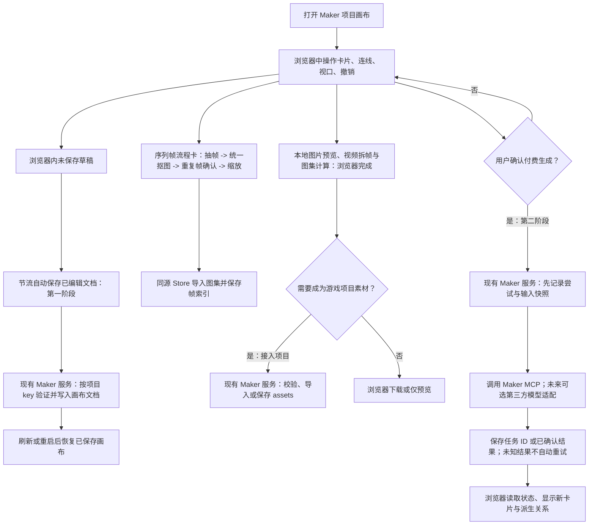

# Maker 自有无限画布：架构与分阶段开发方案

> 2026-09-24 修订。本版取代 2026-09-23 以 FrameCrate Studio 为画布宿主的方案。
> 状态：推荐架构与交付边界已收敛；第 1 阶段的打包、CSP 和项目隔离验收通过后才能视为工程定稿。不能承诺不存在任何未知风险。

> 实施仓：/Users/liangdong/Documents/Mcp/taptap_minigame_open_mcp_2
> 画布交互参考：/Users/liangdong/Documents/mivo-canvas-plugin
> 后半段序列帧能力参考：/Users/liangdong/Documents/MakerTools/framepacker

## 实现状态（2026-09-24 首阶段：基础画布与本地序列帧）

首阶段已在主仓落地，不另起进程，也不把 FrameCrate Studio 当宿主。

- 交互在 `src/maker/canvas/page.ts` 的同源页面里：图片卡、视频输入卡、便签、平移缩放、点选、拖动、撤销/重做，以及已导入图片到未提交视频卡的首帧线。页面不调用生图或生视频。
- 「视频转序列帧」卡片保持原尺寸，仅显示标题、视频来源和已保存的帧缩略图；选中后出现「编辑」。处理步骤移入同页的大弹窗：大预览、底部帧条、右侧当前步骤参数，依次完成抽帧、统一抠图、重复帧确认、尺寸与保存。保存后项目内落一张图集 PNG，并在画布文档记录帧索引与时间。
- 编辑弹窗位于 sequenceEditor.ts，样式位于 sequenceEditorStyles.ts；处理草稿与已保存节点分离，不修改持久化协议。重新编辑不会提前清除旧结果，保存成功才替换并形成一次撤销；保存失败保留草稿供重试，关闭未保存编辑需要确认。草稿不承诺跨刷新恢复，正在写入时禁止关闭。弹窗不另起服务、不嵌入 FrameCrate。
- 帧集结果固定三列平铺，溢出纵向滚动。选中后可创建独立 animation 卡，复制当时已保存的图集路径与帧索引，以 sequence-animation 边记录来源；动画是结果快照，不随源帧集重做自动更新，删除来源不删除动画素材。浏览器本地播放/暂停，播放状态不持久化。此节点类型为新增协议，旧版 Maker 不保证识别，含动画卡的文档应继续使用新版。
- 本轮只补 Framepacker 的手动移除当前帧（至少保留一帧）与尺寸适配选择；重复帧分析后的手动删帧会清除旧候选并要求重新分析。复杂画笔/局部修图、智能跟踪、循环检测、多格式编码导出暂不引入。三列预览不改变实际 PNG 图集排布。
- 处理模块位于 `src/maker/canvas/sequence.ts` 与 `sequenceUi.ts`；只依赖画布文档模型、浏览器媒体 API 和 `CanvasDocumentStore`，不依赖控制台任务队列或 Maker MCP。旧 FrameCrate 只读参考产品流程与行为，不修改、不嵌入，也不运行其页面。
- 正式存档是现有控制台的薄适配：`src/maker/canvas/files.ts`。路径为 `<project>/.maker/canvases/<id>.json`。Git 仓库若未忽略 `.maker`，拒绝写入，不修改 `.gitignore`。导入图片写入 `assets/image/`，这些图片按现有素材规则可被 Git 看到。
- 控制台只负责「创作画布」导航、同源 `/canvas` 子文档、按项目 key 转交请求及文件安全校验；画布自己的文档和交互不进入控制台状态。子文档 `frame-ancestors` 为 `'self'`，父页面脚本信任不放宽。
- 已成功保存的画布在同一项目目录重启控制台后可恢复。克隆仓库不会带上被忽略的画布。未保存的编辑仍可能丢失。
- 每个项目在 `.maker/canvases/active` 单独记录最近打开的画布 id；用户最近选择的项目保存在 Maker 用户级 `console/preferences.json`。显式项目链接优先，失效项目不恢复。
- 真实生图/生视频、生成尝试和 BYO Key 尚未实现。首阶段抽帧不调用付费接口。
- 2026-09-25：支持记录 Maker MCP 已生成图片/视频的提示词、任务标识及 image-to-video 来源边，形成“生图结果 → 图生视频结果 → 拆帧编辑 → 动画结果”的四卡演示。来源不可随意改绑，删除来源卡不删除下游素材。此处是已有生成结果的接入，不代表页面内生成按钮、任务提交和恢复已经实现；现阶段生成仍通过 Maker MCP 执行。
- 画布媒体路由支持受控单区间 Range 请求（206/416 和 Content-Length），用于浏览器视频随机跳帧。缺少分段响应时，真实生成视频曾在抽帧时重复读取旧画面；验收必须使用有明显动作的视频，检查动作姿势而非只比较帧编号。
- 新建画布在创建时写入三张真实示例图片卡，而不是引导便签。素材来自 Mivo 插件的
  public/demo-assets/courage-{1,2,3}.jpg，缩小后内嵌在 Maker bundle，运行时不依赖 Mivo 仓库或网络。
  图片通过既有素材路径写入项目 assets/image/，可能被 Git 收录；初始文档为 revision 0，
  不带生成任务或假连线。加载、保存、重启不补卡，既有画布与用户清空后保存的画布保持原样。
  示例图片可移动、删除或连接视频首帧；删除节点不删除素材文件。

## 1. 产品目标与边界

Maker 控制台拥有自己的无限画布。Mivo Canvas 是空间交互、卡片、端口、连线与创作接力的参考；FrameCrate 是视频处理流程与行为的只读参考，不是画布的页面、进程或项目模型。Maker 首阶段在自由画布里独立实现精简的视频处理卡。

交付分两步：第一步建成可独立使用、无需付费的画布，并完成本地视频到图集的核心流程；第二步再把真实生成结果接入画布，形成「生图 -> 生视频 -> 序列帧」业务流。生图和生视频当前走 Maker MCP；未来允许用户选择自己的模型供应商 API Key，但不为未来供应商预先实现凭证管理或通用参数透传。

已写在 framepacker 的 Vue 画布属于现有原型，不因为做了一半就成为新画布的架构基线。旧工程数据和源码不得直接删除；迁移前先确认其内容与兼容边界。

## 2. 现状中不应沿用的部分

1. 画布必须通过 `FRAMECRATE_STUDIO_DIR` 启动独立 Studio、第二端口和 token 才能使用：这属于原型接入方式，不是 Maker 自有画布的产品需求。
2. 控制台和 Studio 两套生命周期，页面在而 Studio 自行空闲退出；用户看到的连接错误可能有多种原因，不能仅凭错误提示认定进程退出。
3. 旧文档写「FrameCrate 的 React 页面」及依赖 Studio Workflow；实际原型是 Vue，且旧 Workflow、Brief 和新画布不应混为一体。
4. 现有画布生成结果主要由浏览器接收后写回卡片；关页面或响应丢失可能造成远端执行、画布未知的断点。改为控制台服务仍需单独解决这一点。
5. 图片间的线尚未作为 `generate_image` 的参考图输入；不能把只用于展示的线标为「参与生成」。现有可执行关系是图片到视频卡的首帧。
6. FrameCrate 的 `server/`、`src/canvas/` 和 `src/studio/` 尚有未跟踪源码；不可把开发机上的文件误当成各 Maker 发布渠道均可加载的产物。

## 3. 推荐的画布框架

### 程序分层与依赖方向

画布的独立性是代码和业务边界，不是独立进程。`src/maker/canvas/` 负责文档模型、DOM 交互、编辑历史和 `CanvasDocumentStore` 端口；测试可使用内存实现，正式运行由同源 HTTP 适配器实现该端口。`src/maker/console/` 只负责入口、项目 key、Host/Origin 与项目登记校验，再把请求交给画布路由和项目文件适配器。控制台不解析画布节点、不维护画布撤销状态，也不把 Git/构建任务队列注入画布；画布模块不 import 控制台实现、Maker MCP 或 FrameCrate。

实际文件边界是 `src/maker/canvas/model.ts`、`sequenceModel.ts`、`edit.ts`、`sequence.ts`、`sequenceUi.ts`、`store.ts`、`files.ts` 和 `page.ts`；项目路由位于 `src/maker/console/canvasRoutes.ts`。页面只使用 Store 请求分发器，真实路径解析留在控制台项目适配层；Store 接口覆盖画布文档、图片/视频导入与媒体读取。FrameCrate 只提供流程行为参考，Maker 序列帧处理不导入旧页面、旧服务或旧仓代码。第一阶段不实现空 Provider 框架。

### 业务流与本地服务的实际职责

| 用户在画布上做什么                 | 浏览器即可完成                                               | 何时用已有 Maker 本地服务                                                                                        |
| ---------------------------------- | ------------------------------------------------------------ | ---------------------------------------------------------------------------------------------------------------- |
| 平移、缩放、选中、卡片、连线、撤销 | 全部操作和未保存草稿                                         | 不需要画布业务请求                                                                                               |
| 保存/恢复正式项目画布              | 发起保存、显示冲突或未保存                                   | 项目 key 校验、按画布 id 持久化及读取；保证重启后找回                                                            |
| 图片/视频导入与展示                | 选择或拖入本地素材，浏览器预览                               | 图片进入 `assets/image/`；视频进入当前画布 `.maker/canvases/<id>/videos/`，按项目 key 校验并通过同源媒体路由展示 |
| 视频转帧集                         | 浏览器本地抽帧、按样本色统一抠图、重复帧确认、缩放和图集预览 | 保存最终图集 PNG，并将帧率/索引/坐标写入画布文档；不调用 Maker MCP 或第三方 Key                                  |
| 生图、生视频（第二阶段）           | 编辑输入、确认费用、查看状态                                 | 校验项目和输入、记录尝试、调用 Maker MCP、保存任务与结果；不能因断连自动重提                                     |
| 用户 API Key（未来）               | 选择来源和确认付款方                                         | 受控保存和使用密钥、供应商调用与任务状态；不写入画布文件                                                         |

画布不需要自己的本地服务进程。现有控制台服务只在浏览器必须访问项目文件时充当适配层：每个画布请求都按 project key 重新解析登记 realpath，再委托给 `MakerCanvasFiles`；节点交互、平移缩放、撤销、文本编辑与线条判断都在浏览器完成。控制台使用动态端口，所以浏览器 origin 存储不作为正式存档；成功保存的 JSON 写在项目 `.maker/canvases/`，未保存稿只在当前页面内存中。项目选择偏好则写在用户目录，不混入项目画布文件。

### 接入/交付拓扑（不是画布核心的依赖图）

以下是网页入口和交付约束，不能据此倒推画布核心必须依赖控制台服务；第一阶段不会调用 Maker MCP。

- 画布是控制台原生导航项，不再通过 `plugins/:id/open` 拉起 Studio。iframe 只是同源前端页面容器：**不是安全沙箱，也不是第二个服务**；不带 Studio fragment token，不沿用 FrameCrate 的 sandbox、主题握手和跨 origin 消息协议。控制台页仍显示导航，切标签/项目不静默销毁未保存的画布。
- 控制台主页面的内联脚本信任不扩展。画布当前是自包含 DOM 页面，不引入 React、React DOM 或 Vite；`page.ts` 生成 HTML/脚本字符串，控制台 `/canvas` 路由按实际内联脚本计算独立 CSP 哈希。页面与 Store 适配器由现有 esbuild 一起打进唯一渠道文件 `dist/maker.js`，不依赖运行时 `node_modules`、FrameCrate 目录或第二份 `dist/canvas.js`。后续若要替换 UI 技术，应先证明能保持 Store 端口和发布边界，不把 React 作为既定架构。
- 主页面保留 `frame-ancestors 'none'`，画布子文档只允许同源祖先 `frame-ancestors 'self'`；父页面 `frame-src 'self'`。图片、媒体、上传路由遵守同源/Host/Origin 校验。画布同源脚本仍能调用控制台接口，不能把 CSP 或 iframe 当作项目鉴权；后端每次都验证项目权限和文件路径。
- API 统一挂在已登记的 `/api/projects/:key/canvases` 下。服务端先用项目登记表解析已校验 realpath，再读取该项目画布；不接受页面传入绝对项目根、任意素材路径或外部符号链接。`/api/state` 不返回画布文档、素材和凭证。
- 画布文档放在 `<project>/.maker/canvases/<canvas-id>.json`（每张一份）；最近活动 id 单独放在 `.maker/canvases/active`，不混进布局文档。布局包含稳定节点/边 id、坐标、尺寸、视口、文字、项目相对素材路径及 layout revision，不与未来生成尝试共用整文档写入。Git 仓库中若 `.maker/` 未被忽略，写入被拒绝且不自动改 `.gitignore`；忽略后的本地画布不会随 clone 同步。导入图片在项目 `assets/image/`，按项目素材规则可被 Git 看见。项目 A 绝不读取/覆盖项目 B；同一项目两张画布不能相互覆盖。旧 `.framecrate/canvases` 数据只在用户确认时导入新格式，先备份/校验，不自动删除旧数据。
- 用户最近选择的项目是控制台偏好，不是画布文档，保存在 Maker 用户目录 `console/preferences.json`；显式项目链接优先，失效 key 会回退项目列表。此偏好不进入 `/api/state`，也不改变项目文件。
- 控制台页面现有每分钟续期负责唯一服务生命周期；画布 iframe 本身不提供第二套页面租约。关页或关控制台不能默认为取消上游视频任务；第二阶段用持久尝试状态承接。

### 为什么选同源 iframe

同源 iframe 保留控制台导航与主页面 CSP；画布文档、脚本、状态和存储端口在独立画布模块中维护，不把画布业务塞进控制台脚本。它无需第二端口、第二进程、token 或主页面脚本信任改动；iframe 不是安全沙箱，同源画布脚本仍可请求控制台 API。代价是每个保留项目的 iframe 占用内存：切换项目只隐藏，关闭前对未保存编辑明确提示，不静默淘汰。

## 4. 第一阶段：不付费的画布框架

### 必做功能

1. 打开当前 Maker 项目进入自己的画布；新建、重命名、选择画布。刷新后回到稳定的 canvas id，不用未排序目录扫描猜第一张。一个项目可有多张画布，切项目不串图。
2. DOM 图片卡、便签、空视频输入卡和本地视频素材卡；工具栏和画布内添加，卡片尺寸和选中状态明确。图片和视频导入都校验类型/大小并写入当前项目受控位置，文档只存项目相对路径。展示失败有明确提示。
3. 平移、滚轮锚点缩放、适配内容；点选/多选/框选、拖动、缩放卡片。Shift/Cmd/Ctrl 框选可追加；按住 Space 从卡片上拖动也要平移。输入框、弹层、拖入文件不误触画板，桌面和窄屏操作可用。
4. 选中图片卡后有符合 Mivo 操作习惯的下一步入口：单击在旁边创建空视频输入卡、拖到空白处创建、拖到已有视频输入卡绑定首帧；选择多图时不能伪称支持视频多首帧。无效连接（自连、重复、不可用素材或已锁定）给出原因。可以断开/替换尚未提交的首帧。
5. 连线数据必须有真实语义。第一阶段仅保存「图片素材 -> 视频输入卡的首帧」关系；卡内可预览来源图，明确显示「生视频将在下一阶段接入」，不自动提交付费任务。不提供未接通的图片到图片参考线；未来结果到来源的派生线是只读来源说明，不代表再次生成。
6. 撤销/重做回退卡片删除、布局、文本和未提交连线，不删除已经导入的文件；视口平移/缩放不应被内容撤销意外跳回。图片导入期间切画布要等导入完成后保存；关闭画布时阻止销毁进行中的导入。自动保存节流且显示「保存中/已保存/未保存/保存失败」；409 冲突保持本地编辑并提示处理，不静默覆盖磁盘或假装保存成功。失焦和切项目尽力保存；浏览器崩溃不能承诺找回尚未保存的一小段编辑。
7. 同项目同时打开两张画布，保存只更新各自文档。媒体读取/导入拒绝跨项目路径和链接逃逸；长列表、可视节点数量和保留 iframe 数量设有界策略，达到边界必须向用户解释而非丢弃未保存状态。
8. 视频素材可新建约普通图片卡 3 倍面积的序列帧卡。阶段依次为区间/FPS 抽帧、从首帧取背景样本并统一抠除边缘连通近似纯色、疑似重复帧人工确认、统一尺寸/适配、图集预览与保存。每步显示状态、真实进度、帧分布及可读失败原因；不发起生成请求。
9. 首版视频限制为 MP4/MOV/WebM 且不超过 100 MiB；抽帧和 Canvas 处理在浏览器本地完成，按图集边长、输出帧数和输入像素预算拒绝超限任务。抠图是简化的纯色背景去除，不是 AI 主体分割；不含 FrameCrate 完整编辑器、智能运动跟踪或多格式动画导出。成功输出为项目内单张 PNG 图集，帧索引保存在画布文档。

参考 Mivo 的 `src/canvas/MivoCanvas.tsx`、`imageSlotPorts.ts`、`imageSlotWiring.ts`、`src/store/historyManager.ts` 中的交互/纯函数，不整文件照搬 Cindy 宿主、Leafer、笔刷、Agent、协作、图片槽的多参考图提交协议。复制代码前核对依赖和许可；Maker 页面只实现实际能执行的业务边。

### 不在第一阶段实现

不接真实生图、生视频、三视图、AI 智能抠图、完整单帧编辑器、GIF/视频/APNG 导出、序列帧播放、供应商配置或计费；不新增通用插件命令、运行时安装器、跨客户端素材锁或第二套服务。为第二阶段预留稳定 canvas/node/edge id 和项目相对素材路径即可；**不提前实现空的 Provider 框架、任务账本或 Key 存储**。

### 第一阶段验收门槛

- 使用真实 `dist/maker.js` 及至少一个打包渠道运行，不靠 FrameCrate 源仓服务；画布导航、内嵌页面、保存、刷新、多项目切换和窄屏都可实际操作。
- 父页面 CSP 不变宽；子页面同源嵌入成功、外站嵌入失败；画布 API 的跨项目、绝对路径、符号链接和跨站写入负向测试通过。
- 同一项目两张画布同时编辑不会串数据；同一张画布的冲突返回 409 并保留本地未保存稿。刷新只恢复已成功保存的版本；切项目不静默丢未保存稿。
- 用本地文件验证导入、图卡 -> 视频输入卡、断线/换图、撤销/重做、保存后重新打开；不发送任何付费任务。验证新增前端资源确实打进 npm/Codex/WorkBuddy 所使用的 Maker bundle，DSH 依赖的旧 Maker 版本不被误宣称有画布。
- 用可解码本地视频走完抽帧、采样抠图、重复帧确认、缩放、图集保存和重载；验证取消、超出帧数/图集容量、视频解码失败时状态真实且不误报保存成功。

## 5. 第二阶段：真实生成业务接入

本阶段开始前先确认 Maker MCP 的真实工具 schema、输入路径与实际定价提示，不能从旧 Studio Workflow 推导新接口。图片到图片的参考输入只有在真实接入 `generate_image.reference_images` 并通过端到端验收后才开启相应端口；首帧来源关系在提交时成为不可变输入快照。

- 画布 API 使用服务端生成尝试记录：先持久化本地 attempt id、画布/节点 id、provider、输入快照和用户确认，再派发一次。页面请求只返回尝试身份，不靠浏览器长时间等待结果。Maker 工具未证明支持远端幂等或按条件找回任务；本地幂等只能挡重复本地提交，不能假称跨断连找回。无远端 task id 的结果未知时禁止自动重发，明确告知用户核查；有 task id 才查原视频任务，遵守工具规定的查询间隔。
- 布局由页面写，尝试与结果由服务端写；拆成互不覆盖的读写边界，结果节点 id 和派生关系在服务端确认文件后固定。GET 可以合并展示，布局 PUT 不得写回任务状态、文件路径或派生边；撤销布局不撤销付费生成。结果与保存同一时刻完成的竞态必须专项测试。
- 生成结果只接受当前项目内可核实的素材相对路径。生成视频成为项目内视频素材后，复用第一阶段 Maker 序列帧模块处理；FrameCrate 仍只作流程参考，不调用旧仓页面/服务，也不把未许可源码作为运行时依赖。
- 视频先按当前 Maker 支持的首帧模式接入；必须向用户确认将调用模型及其计费口径。没有积分余额接口就不虚构余额；生图无可信报价时不编造积分。用户明确确认前不得提交，超时/未知结果不得自动重新扣费。
- 上游 Maker 若把生成文件直接写入最终路径，可能与构建/Git 并发读取冲突。先做并发复现和平台验证，再决定是否需要把下载写入忽略目录并原子重命名；不要为了推测风险预先加跨 CLI/控制台/IDE 的全局业务锁。

## 6. 后续用户自定义 API Key

不是第一阶段交付。当前画布业务只依赖「按所选生成来源查询能力、经确认提交、查询原任务/结果」这样的调用边界；不要把 Maker `generate_image` 的参数直接写死到画布文档。第二阶段 Maker MCP 适配器稳定后再增加具体供应商适配器，各自声明模型/图片参考数/时长/异步查询能力，不做通用透传或失败自动改走另一付款方。

自定义 Key 仅在服务端受控的用户级凭证存储中使用，不能放项目文件、画布 JSON、前端持久状态、日志或子进程环境变量。Windows 不能把 POSIX `0600` 当成凭证保护方案，需要单独验证受支持的系统凭证机制。用户选定的来源和付款方必须在每次尝试提交前确认；厂商无报价时如实提示外部账户计费及不可精确预估，不能冒充 Maker 积分。

## 7. 不可跳过的开发顺序

1. 从 Maker 控制台主仓出发，先证明新同源页面、CSP 和画布前端确实可从各 Maker 发布产物加载；测打包大小/启动性能。失败则停止并重新评估前端装载，不回退成独立 Studio 服务。
2. 实现第一阶段画布、项目级文件适配器和本地序列帧卡，按不付费场景逐项截图、测试并对照 Mivo 与 FrameCrate 的实际流程；不要先实现生成任务框架来掩盖编辑/流程体验不足。
3. 第一阶段验收通过后，再接 Maker 生图/视频和持久尝试，端到端推演任务中断、计费确认、结果写入、并发保存，并验证生成视频可通过已有序列帧卡处理。真实付费验收需单独明确预算；测试桩不能冒充远端成功。
4. 旧 `.framecrate` 画布数据在确认迁移方式前保持只读；新画布导航验收后才撤掉旧「创作画布」入口，避免两套页面同时自称正式画布。必要的用户说明同步更新 README 和开发指南，不顺带重构无关 Maker 功能。
